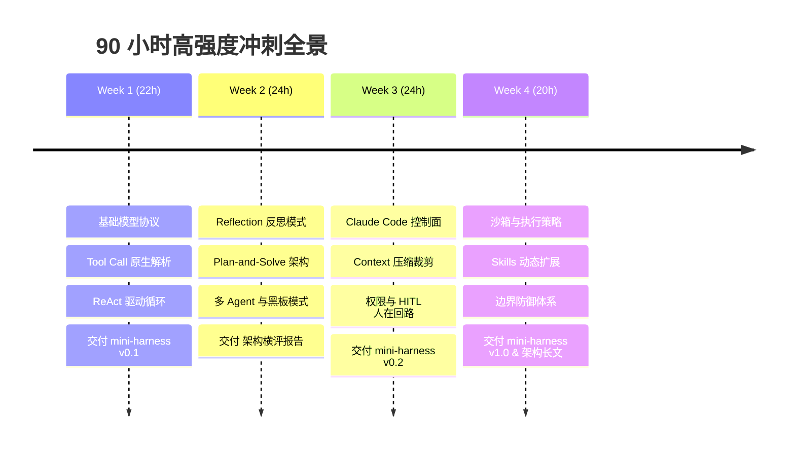

# 🧠 Agent Architect Lab / 智能体架构与驾驭工程实验室

> 一个以**高强度交付（Output-Driven）**为导向的 AI Agent 架构体系学习与实战沉淀库。  
> 深入剖析经典范式，亲手实现核心运行循环，对标 Claude Code / Codex 工业级 Harness Engineering 架构。

---

## 🎯 学习强度与目标规划

* **工作日投入**：2.0 ~ 3.0 小时 / 天
* **周末投入**：4.0 ~ 5.0 小时 / 天
* **每周总学时**：**20 ~ 25 小时**
* **总冲刺周期**：4 周（目标累计 **90 小时**）
* **三大底座参考项目**：
  1. [ai-agents-from-scratch](https://github.com/pguso/ai-agents-from-scratch)：零依赖原生手搓骨架
  2. [all-agentic-architectures](https://github.com/FareedKhan-dev/all-agentic-architectures)：35 种 Agent 架构全景与对比
  3. [harness-books](https://github.com/wquguru/harness-books)：Claude Code & Codex 工业级架构与工程防御

---

<!-- DASHBOARD:START -->
### 📊 学习进度与工时看板 (实时同步)

* **总投入学时**：`43.5` / `90.0` 小时
* **总完成进度**：`[████████████░░░░░░░░░░░░]  48.3% (43.5h / 90.0h)`
* **最近更新**：`2026-09-10 23:49`

| 阶段 | 阶段主题 | 学时投入 (当前/目标) | 进度 | 状态 | 核心交付成果 |
| :--- | :--- | :---: | :---: | :---: | :--- |
| Phase 1 | Phase 1: 核心机制手搓 (ai-agents-from-scratch) | 13.0h / 22.0h | 59.1% | 🟡 推进中 | mini-harness v0.1 (原生 CLI ReAct 智能体) |
| Phase 2 | Phase 2: 架构纵横对比 (all-agentic-architectures) | 16.5h / 24.0h | 68.8% | 🟡 推进中 | Agent 架构横向基准评测报告 (ReAct vs PEV vs Reflection) |
| Phase 3 | Phase 3: 工业级工程防御 (harness-books Book 1) | 14.0h / 24.0h | 58.3% | 🟡 推进中 | mini-harness v0.2 (集成 Context Compaction + 权限中断 + 崩溃自愈) |
| Phase 4 | Phase 4: 工业体系与方法论 (harness-books Book 2) | 0.0h / 20.0h | 0.0% | ⚪ 未开始 | mini-harness v1.0 完备版 + 《现代 AI Agent Harness 架构精要》深度长文 |
<!-- DASHBOARD:END -->

---

## 🛠️ 打卡与进度跟踪工具 (Tracker CLI)

本仓库提供配套命令行工具，用于沉淀每日学习时长、心得并自动更新 README 看板与日志：

```bash
# 1. 每日学习打卡（记录工时、任务、收获，支持阶段 1-4）
python3 scripts/tracker.py log --hours 2.5 --task "分析 09_react-agent 并手写驱动循环" --phase 1 --notes "搞懂了 Thought-Action 边界与死循环阻断"

# 2. 随时查看学习工时仪表盘与燃尽进度
python3 scripts/tracker.py status

# 3. 自动生成阶段复盘报告 (保存至 progress/weekly_reports/)
python3 scripts/tracker.py report
```

---

## 🗺️ 四周高强度冲刺路线图



### 📅 Week 1: 穿透底层齿轮 —— 手搓核心循环 (目标: 22h)
* **主攻项目**：[ai-agents-from-scratch](https://github.com/pguso/ai-agents-from-scratch)
* **每日排期**：
  * **Day 1 (2.5h)**：读透 `01_intro` ~ `06_coding`，理清模型 API 的原始消息流结构（System/User/Assistant/Tool 角色分工）。
  * **Day 2 (2.5h)**：精读 `07_simple-agent`，不依赖任何第三方库，手写单次 Tool Call 的函数派发器（Dispatcher）。
  * **Day 3 (2.5h)**：精读 `08_simple-agent-with-memory`，实现会话历史追加与多轮状态留存机制。
  * **Day 4 (3.0h)**：攻克 `09_react-agent`，实现 `Thought -> Action -> Observation` 核心死循环拦截器（Max Steps 保护）。
  * **Day 5 (2.5h)**：研读 `11_error-handling`，实现工具报错捕获与模型反省自愈机制。
  * **Weekend (9.0h)**：**实操交付 `mini-harness v0.1`**。封装一个终端 CLI，具备自主读取文件、Shell 执行与词频分析的能力，撰写测试用例。

### 📅 Week 2: 纵横对比 —— 35 种架构选型与横评 (目标: 24h)
* **主攻项目**：[all-agentic-architectures](https://github.com/FareedKhan-dev/all-agentic-architectures)
* **每日排期**：
  * **Day 8 (2.5h)**：Notebook 01 & 02（Reflection 与并行 Tool Use），对比单轮调用 vs 反思循环的质量差异。
  * **Day 9 (2.5h)**：Notebook 04（Planning）& 06（PEV: Plan-Execute-Verify），分析执行阶段与规划阶段解耦的好处。
  * **Day 10 (2.5h)**：Notebook 05（Multi-Agent）& 07（Blackboard 黑板模式），理清多智能体路由与共享黑板架构。
  * **Day 11 (2.5h)**：Notebook 08（Episodic & Semantic Memory）& 12（Graph Memory），掌握分层记忆体系。
  * **Day 12 (3.0h)**：Notebook 09（Tree of Thoughts）& 11（Meta Controller），理解动态决策流。
  * **Weekend (11.0h)**：**实操交付《Agent 架构横向基准评测报告》**。针对同一真实任务（例如重构一个含 Bug 模块），测试 ReAct vs PEV vs Reflection 的耗时、Token 消耗及通过率。

### 📅 Week 3: 工业级蜕变 —— 驾驭工程与系统防御 (目标: 24h)
* **主攻项目**：[harness-books Book 1](https://github.com/wquguru/harness-books/tree/main/book1-claude-code)
* **每日排期**：
  * **Day 15 (2.5h)**：研读 Ch 1 & Ch 2，理解“模型是引擎，Harness 是车身”以及 Prompt 作为控制面的状态机原理。
  * **Day 16 (2.5h)**：研读 Ch 3，分析 Query Loop 驱动机制与心跳检查。
  * **Day 17 (3.0h)**：研读 Ch 4，深入工具权限分级、拦截器与人在回路（HITL Interrupt）设计。
  * **Day 18 (3.0h)**：研读 Ch 5，**攻克上下文压紧（Context Compaction）**—— 滑动窗口、记忆剪枝与结构化摘要。（微专题：[大模型推理底座与前缀缓存机制](docs/03-harness-engineering/supplementary_llm_inference_and_prefix_caching.md)）
  * **Day 19 (3.0h)**：研读 Ch 6，崩溃恢复、子进程隔离与死锁熔断机制。
  * **Weekend (10.0h)**：**实操交付 `mini-harness v0.2`**。把 Compaction、权限拦截与错误自愈写入自己的 Agent，完成 50 步长链路测试。

### 📅 Week 4: 体系沉淀 —— 架构分歧与工业总结 (目标: 20h)
* **主攻项目**：[harness-books Book 2](https://github.com/wquguru/harness-books/tree/main/book2-comparing)
* **每日排期**：
  * **Day 22 (2.5h)**：Claude Code 与 Codex 的控制面与执行线程对比（Loop, Thread & Rollout）。
  * **Day 23 (2.5h)**：安全沙箱（Sandbox）与本地治理策略（Local Governance）。
  * **Day 24 (2.5h)**：Skills 动态挂载机制与委托执行（Delegation & State）。
  * **Day 25 (2.5h)**：收敛与分歧：未来生产级 Agent 的架构演化共识。
  * **Weekend (10.0h)**：**双重收尾交付**：
    1. 发布 **`mini-harness v1.0`**（支持 Skills 插件化、完备测试、CLI 文档）；
    2. 撰写 **《解密现代 AI Coding Agent 的 Harness 架构》** 深度工程长文。

---

## 📂 仓库结构

```text
agent-architect-lab/
├── README.md                     # 核心看板与阶段冲刺路线图
├── progress/                     # 进度跟踪与复盘
│   ├── tracker.json              # 结构化打卡数据
│   ├── daily_logs/               # 每日学习日志 (YYYY-MM-DD.md)
│   └── weekly_reports/           # 阶段复盘报告
├── docs/                         # 知识沉淀与报告
│   ├── 01-architecture-notes/    # 架构拓扑笔记 (ReAct, PEV, Blackboard 等)
│   ├── 02-benchmark-reports/     # 架构横向评测报告
│   └── 03-harness-engineering/   # Claude Code / Codex Harness 架构深度剖析
├── mini-harness/                 # 核心代码资产: 自主研发的工业级 Coding Agent
│   ├── src/                      # 源码 (Runtime, Loop, Tools, Compaction, HITL)
│   └── tests/                    # 单元测试与端到端验证
└── scripts/
    └── tracker.py                # 工时打卡、看板更新与报告生成 CLI
```
