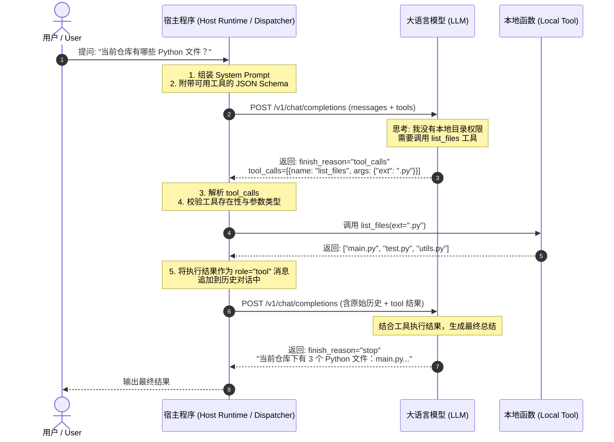

# Day 1 架构精要：函数调用（Function Calling）与工具派发内核

> **学习目标**：掌握大模型从纯文本生成迈向“具身行动（Agency）”的核心机制——Tool Call 协议与宿主运行时派发器（Dispatcher）。

---

## 1. 为什么说 Function Calling 是 Agent 的分水岭？

普通 LLM 是一个**纯文本转换器（Text in, Text out）**。它无法感知当前时间、无法读取你的私有代码库、无法在终端执行 `pytest`。

```text
传统模式 (Chatbot):
用户输入 -> LLM 生成文本 -> 用户肉眼看

智能体模式 (Agent):
用户输入 -> LLM 输出结构化调用意图 (Tool Call)
        -> 宿主程序执行真实代码 (Tool Execution)
        -> 结果喂回 LLM -> LLM 最终回答 (或发起下一轮调用)
```

**关键认知**：**大模型自己从来不运行任何代码！**  
大模型所做的唯一事情，就是根据上下文预测出一段符合 JSON 语法的结构化文本（包含函数名与入参）。真正的执行者永远是外围的**宿主运行时（Host Runtime）**。

---

## 2. 完整的 Tool Calling 交互时序图



---

## 3. 协议拆解：JSON Schema 的作用

为了让 LLM 知道能调用什么，宿主必须提供一套严谨的工具契约（JSON Schema）：

```json
{
  "type": "function",
  "function": {
    "name": "read_file",
    "description": "读取本地文件内容并返回文本",
    "parameters": {
      "type": "object",
      "properties": {
        "filepath": {
          "type": "string",
          "description": "要读取的文件绝对路径或相对路径"
        }
      },
      "required": ["filepath"]
    }
  }
}
```

* **`name`**：工具唯一标识，模型输出匹配此字符串。
* **`description`**：**最重要的 Prompt 一部分**！模型根据描述语义判断是否该用这个工具。
* **`parameters`**：声明参数类型与必填项，约束模型输出符合 JSON Schema 规范。

---

## 4. 宿主派发器（Dispatcher）的核心防御

在工业级实现中，Dispatcher 必须具备三层防御：
1. **参数容错解析**：模型偶尔会输出带 markdown 标记的代码块（如 ` ```json `）或非法转义，解析器需做容错。
2. **工具存在性校验**：防御模型幻觉出不存在的工具名称（Hallucinated Tool）。
3. **异常捕获与沙箱**：当工具执行抛出异常（如 `FileNotFoundError`、`PermissionDenied`）时，**绝不能让宿主崩溃**，必须将异常信息格式化为工具输出返回给模型，触发模型的自我反思修复。
