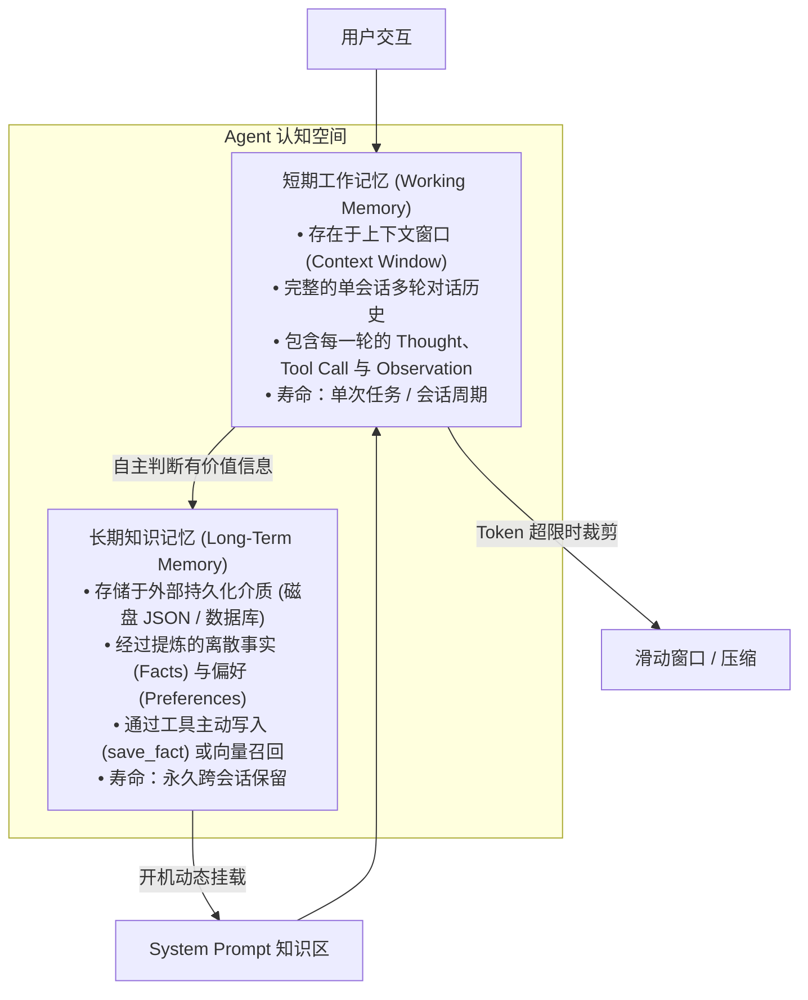

# Day 2 架构精要：状态管理与分层记忆体系（Working vs Persistent Memory）

> **学习目标**：掌握 Agent 如何从“一轮一忘”的无状态单次调用，跃升为能够跨轮次追踪任务状态、跨会话持久化知识的“有记忆智能体”。

---

## 1. 记忆的本质：双层记忆模型

在认知心理学与现代 Agent 工程中，记忆主要分为两层：



| 记忆维度 | 短期工作记忆 (Working Memory) | 长期事实记忆 (Long-Term Memory) |
| :--- | :--- | :--- |
| **存储介质** | 模型上下文 Token 窗口（内存序列） | 本地文件（JSON/SQLite/向量库） |
| **内容粒度** | 原始对话流、中间工具调用出入参 | 结构化事实（Key-Value、偏好、知识） |
| **生命周期** | 随当前进程退出或窗口滑动截断 | 跨进程、跨会话永久留存 |
| **更新机制** | 宿主程序自动每轮追加 | Agent 自主调用工具判定并写入 |

---

## 2. 宿主协议核心：消息拓扑严格配对规则

许多初学者写多轮 Agent 时，经常遇到模型服务报错 `400 Invalid message sequence`，根本原因在于破坏了 **OpenAI 消息时序拓扑**：

```text
合法序列：
1. [system]    System Prompt (系统人设与规则)
2. [user]      用户说: "请读取 a.txt"
3. [assistant] 模型回复: tool_calls=[{id: "call_abc", name: "read_file", args: {"filepath": "a.txt"}}]
4. [tool]      工具返回: tool_call_id="call_abc", content="hello world"
5. [assistant] 模型回复: "a.txt 的内容是 hello world"
6. [user]      用户追问: "那它的行数是多少？"
...
```

### 必须坚守的三条铁律：
1. **Tool 紧跟 Assistant 铁律**：如果上一条 `assistant` 消息包含了 `tool_calls`，接下来的消息**必须**是 `tool` 角色，绝不能插入 `user` 或另一个纯文本 `assistant` 消息。
2. **ID 严格一致铁律**：`role: "tool"` 消息中的 `tool_call_id` 必须与上一轮模型给出的 `call_id` **字符完全匹配**。若模型并发输出了 3 个 tool_calls，则必须紧跟 3 条独立的 `tool` 消息。
3. **原子性裁剪铁律**：在做滑动窗口裁剪时，**严禁从 tool_calls 与 tool 响应中间截断**！必须以完整的「Turn（一问一答一调用）」为原子单位整体进出。

---

## 3. 长期记忆的“主动捕获”设计模式

Agent 如何形成长期记忆？不是机械地把所有聊天记录塞进文件，而是**把记忆管理当作一种能力赋予 Agent**：

1. **定义记忆工具**：
   - `save_fact(key, value, category)`: 供模型主动记录关键信息。
   - `query_facts(keyword)`: 供模型主动检索旧知识。
2. **System Prompt 赋予自省动机**：
   > *"当你获知关于用户偏好、项目结构或环境约束的关键信息时，主动调用 save_fact 保存它。"*
3. **开机启动装配**：
   在下次会话启动时，宿主程序自动读取持久化存储，将提炼好的事实渲染至 System Prompt 底部，Agent 从而实现“开机秒记”。
