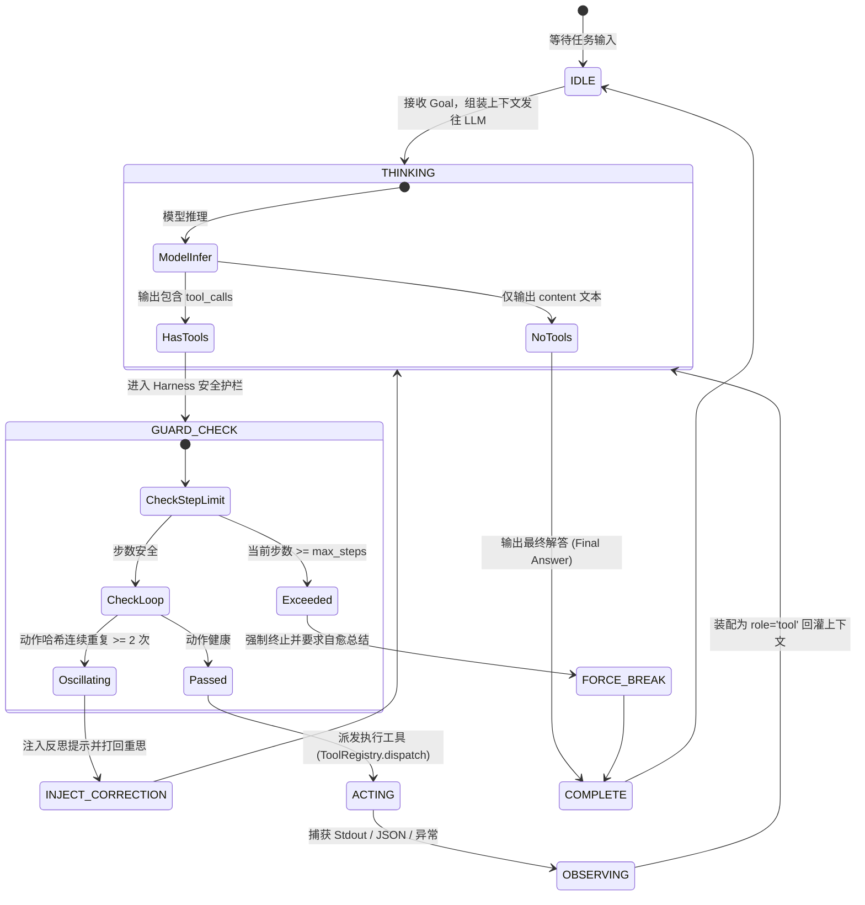

# Day 3 架构精要：ReAct 自主驱动循环与工业级死循环防御（Harness Loop Guard）

> **学习目标**：掌握现代智能体核心运行范式 —— **ReAct (Reasoning + Acting)** 的底层机制，实现从“单步被动应答”到“多步自主闭环”的飞跃，并建立工业级死循环熔断与可观测性防御体系。

---

## 1. 为什么是 ReAct？传统模式的破局者

在 ReAct 范式出现之前，LLM 面临两大天然瓶颈：
1. **纯推理范式（Chain of Thought / CoT）**：模型在脑内进行多步思考，但无法与真实世界交互，无法获取外部事实（如查询数据库、读取本地文件），且大模型心算数学极易产生累积幻觉。
2. **纯动作范式（Act-Only / Direct Tool Use）**：模型遇到问题直接调工具，缺乏“先想后做”、“评估结果”的推理链，面对复杂的依赖任务时如同无头苍蝇，不知道下一步该干什么。

**ReAct (Yao et al., 2022)** 将**推理（Reasoning）**与**行动（Acting）**紧密咬合：
$$\text{Thought} \longrightarrow \text{Action} \longrightarrow \text{Observation} \longrightarrow \text{Thought} \longrightarrow \dots \longrightarrow \text{Final Answer}$$

- **Thought（思考）**：分析当前状态，拆解子目标，规划下一步应该调用什么工具及为什么。
- **Action（行动）**：执行外部工具，输入参数，引发外部环境变化。
- **Observation（观察）**：捕获工具执行的真实输出，将其作为新的事实回灌给模型。

---

## 2. 状态机与双重实现流派对比

### ① Prompt 纯文本解析流派 vs ② 工业级原生 Function Calling 流派

在早期（如 `ai-agents-from-scratch/09_react-agent`）或不支持原生 Tool Calling 的开源小模型中，通常采用 **Prompt 约定法**：
- 让模型在输出中手写文本：`Thought: ... \n Action: tool_name(args)`；
- 宿主程序用正则表达式切出 `Action:`，执行工具后再拼入 `Observation: ...`。
- **缺陷**：正则极脆弱，参数包含特殊字符或换行时解析极易崩溃，容错率低。

**现代工业级 Harness（Claude Code / Codex / OpenAI）标准实现**：
- 利用模型原生的 **Structured Tool Calling (JSON Schema)**；
- 模型的 `content` 或 `reasoning_content` 承载 **Thought**；
- 结构化的 `tool_calls: [{id, function: {name, arguments}}]` 承载 **Action**；
- 标准的 `role: "tool"` 消息承载 **Observation**。

---

## 3. 智能体的“鬼打墙”：死循环的三大死因与防御工程

在工业落地中，让 Agent 自主循环运行最危险的问题不是模型报错，而是**陷入静默死循环（Infinite Execution Loop）**，这会导致 Token 瞬间耗尽、账单激增，甚至对生产环境造成破坏。

常见死循环模式及防御策略：

| 死循环模式 | 典型现象 | 诱发根因 | Harness 防御策略 |
| :--- | :--- | :--- | :--- |
| **1. 参数停滞 (Stagnation)** | 连续数轮用相同的路径调 `read_file`，哪怕文件不存在 | 模型没有根据报错更新假设，陷入局部吸引子 | **Action Signature Hashing**：计算 `hash(tool_name + sorted_args)`，连续重复 $\ge 2$ 次直接阻断并注入惩罚性 Prompt |
| **2. 步数失控 (Step Runaway)** | 在几个文件之间反复跳跃搜索，无法收敛到答案 | 任务拆解过大，或模型缺乏收敛终局意识 | **Max Steps Hard Guard**：设置硬上限（如 8~10 步），到达步数强行打断并强制模型生成当前已知结论 |
| **3. 工具报错振荡 (Error Ping-Pong)** | 工具抛出权限或参数错误，模型不断尝试微调语法再次重试 | 错误信息晦涩，模型无法理解真正失败原因 | **Structured Error Feedback**：工具异常由 Harness 统一包装为清晰的语义错误，引导自愈 |

---

## 4. 关键指标与可观测性（Observability）

一个合格的 Harness 执行器必须提供结构化的 **Execution Trace**：
1. **Step Index**：当前第几步迭代。
2. **Step Latency**：每一步模型推理耗时与工具执行耗时。
3. **Action Preview**：调用的工具名称与紧凑参数。
4. **Observation Summary**：截断展示工具的真实反馈（避免巨量输出直接刷屏）。
5. **Token Accumulation**：每轮累积的输入输出 Token 估算。

这些信息不仅是控制台日志，更是后续进行 **Context Compaction（上下文压紧剪枝）** 的核心依据。
