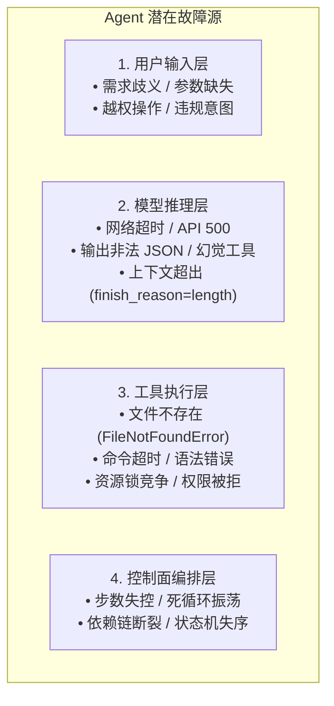
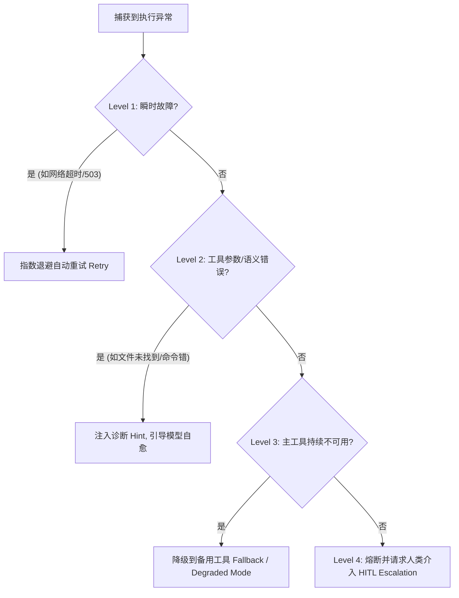

# Day 4 架构精要：智能体鲁棒性工程与异常自省自愈机制 (Fault Tolerance & Self-Healing)

> **学习目标**：深入理解智能体系统为何比传统软件更易出错，建立标准化的错误分类分级（Taxonomy），实现工具异常语义诊断回灌与大模型自省自愈闭环。

---

## 1. 为什么智能体更容易崩溃？

传统软件是**确定性控制流**：输入明确、分支确定、依赖稳定。
而 AI Agent 是由大模型驱动的**多步非确定性编排系统**，它在运行中串联了多个极易失效的环节：



如果采用传统开发中的 `try ... except Exception: raise`，任何一个微小错误都会导致 Agent 进程暴毙，前功尽弃。
因此，Harness 工程的核心使命就是：**把“异常”转化为“新事实”，让模型“在碰壁中学会转弯”**。

---

## 2. 统一错误分类分级体系 (Error Taxonomy)

对标工业级 Harness（参考 `ai-agents-from-scratch/11_error-handling`），我们将运行时所有错误归一化为四大标准分类：

| 错误类别 | 典型触发场景 | 是否可直接重试 | 宿主处理策略 |
| :--- | :--- | :---: | :--- |
| **`ValidationError`** | 用户输入非法、工具必填参数漏传 | ❌ 否 | 快速失败，格式化友好文本提示调用方 |
| **`LLMCallError`** | 本地模型加载慢超时、网络断开、503 服务过载 | ✅ 是 | **指数退避重试 (Exponential Backoff with Jitter)** |
| **`ToolExecutionError`** | 文件名拼错、除以零、命令执行退出码非 0 | 🔄 模型重试 | **语义包装 + 诊断指引 (Diagnostic Hint)** 回灌上下文 |
| **`WorkflowError`** | 上下文超限截断 (`finish_reason='length'`)、步数打满 | ❌ 否 | 触发安全护栏强行收敛或发起上下文压缩 |

---

## 3. 自省自愈闭环（Self-Correction Feedback Loop）

自愈不是魔法，而是**通过信息完备的 Observation 激发模型的自省能力（Reflective Reasoning）**。

### 差的错误回灌（导致模型继续鬼打墙）：
```text
[Observation]: Error: [Errno 2] No such file or directory: 'mini-harness/data/user.json'
```
*后果*：模型不知道当前有哪些文件，只能瞎猜，或者直接放弃。

### 工业级语义诊断回灌（激发自愈）：
```text
[Observation]: [ToolExecutionError: FileNotFoundError] File 'mini-harness/data/user.json' does not exist.
DIAGNOSTIC HINT: The target path does not exist. Please check your spelling, or call 'list_dir' first to inspect existing files in the directory before retrying.
```
*效果*：模型读到 Hint 后，立刻在下一个 Thought 中自我纠正：
> *“原来该文件不存在，我先调用 `list_dir` 看看目录下到底有什么文件。”*

---

## 4. 工业防御四级恢复阶梯 (Recovery Ladder)

在真实的生产级 Harness（如 Claude Code）中，错误处理是一个逐级升级的梯次：



今天我们在 `mini-harness` 中正式实现 Level 1（LLM 指数重试）与 Level 2（语义诊断与模型自愈），让智能体具备强大的自愈韧性。
