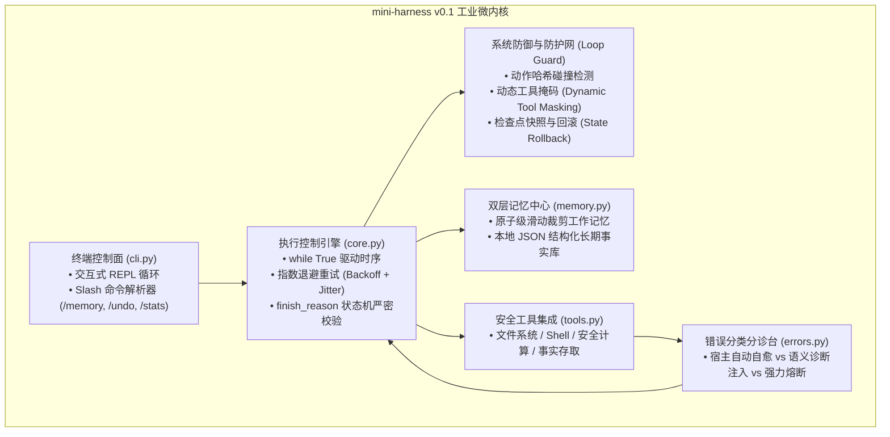

# Day 5 架构精要：mini-harness v0.1 工业原型与动态工具掩码 (Dynamic Tool Masking)

> **学习目标**：完成 Phase 1 终局收官，将前序手搓的所有机制融合为模块化、高可用的生产级微内核智能体 `mini-harness v0.1`，并落地根治死循环振荡的终极武器 —— **动态工具掩码（Dynamic Tool Masking）** 与 **上下文检查点回滚（Checkpoint Rollback）**。

---

## 1. 架构总览：从“碎片实验”到“工业微内核”

在前 4 天的实战中，我们分别独立攻克了：
- **Day 1**: 原生 Tool Calling 协议与动态 JSON Schema 生成
- **Day 2**: 双层分层记忆（短期工作窗口 vs 长期持久化事实）
- **Day 3**: 原生 ReAct 驱动循环与基础步数熔断
- **Day 4**: 错误分类分级体系与模型异常自愈

在 Day 5，我们将其凝练为工业级微内核结构：



---

## 2. 根治死循环振荡：动态工具掩码 (Dynamic Tool Masking)

在面对复杂长链路任务时，模型经常陷入**局部极值（Attractor State）**：明知调用工具 A 出错了，但在上下文自我增强的诱导下，第 2 次、第 3 次依然执迷不悟地重复调用工具 A。

### 为什么单纯的 Prompt 警告经常失效？
大模型是**基于 Attention 机制的概率预测引擎**。当上下文中充斥着工具 A 的调用记录时，工具 A 对应的 Token 权重极高。即使宿主注入了 Warning，模型在生成下一个 token 时依然极易被“吸”向工具 A。

### 动态工具掩码（Tool Masking）的物理切断：
不依赖模型的“自我反省”，而是**从输入根源上直接没收它的作案工具**：

```python
# 当检测到 tool_A 发生重复无进展调用时：
if is_stuck:
    # 宿主在组装发给 LLM 的 tools payload 时，动态剔除 tool_A
    active_tools = [
        t for t in all_tools 
        if t["function"]["name"] != offending_tool_name
    ]
```

```text
[第 1 轮] 模型调 read_file('bad.txt') -> 报错
[第 2 轮] 模型再次调 read_file('bad.txt') -> 触发 Tool Masking！
           宿主注入警告，并在下一轮的 tools 列表中彻底拔掉 read_file！
[第 3 轮] 模型眼里的工具列表只剩：[list_dir, calculate, run_command, write_file]
           read_file 消失了！模型想调也调不了，被迫立刻转向 list_dir 探查！
```

---

## 3. 上下文快照与回滚 (Checkpoint & Rollback)

为了彻底解决“上下文毒化（Context Poisoning）”问题，`mini-harness v0.1` 引入了**原子轮次快照机制**：
1. **快照生成**：在每一次用户发出新任务前，自动保存当前消息历史与记忆的快照；
2. **主动回滚（`/undo`）**：如果某一轮推演发生严重偏航或上下文严重毒化，用户或宿主引擎可一键调用 `rollback()`，瞬间回到上一轮的干净状态；
3. **彻底抹除中毒 Token**：消除死循环残留对后续推理的一切负面干扰。

---

## 4. 交付总结与工业对照

`mini-harness v0.1` 是一个真正的**零重量级、零三方黑盒依赖、纯 Python 原生手搓的工业级 Harness 原型**。
它在仅仅几百行代码里，实现了 Claude Code / Codex 等顶级 Agent Harness 的控制面核心精髓：
- **引擎驱动**：非确定性模型 $\to$ 确定性状态机
- **双轨记忆**：工作窗口 $\to$ 长期知识沉淀
- **深度自愈**：底层异常 $\to$ 语义诊断指引
- **刚性防御**：注意力锁死 $\to$ 动态工具掩码
