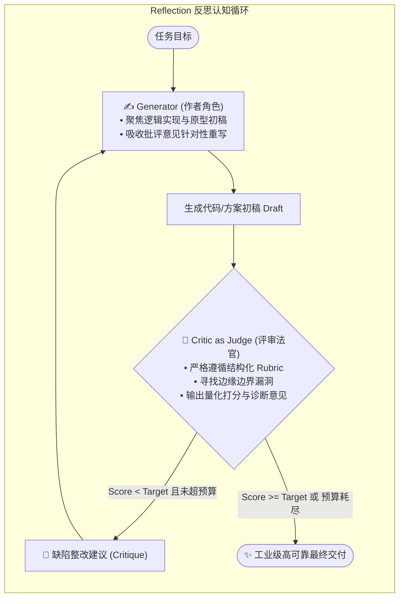

# Phase 2 架构精要：Reflection（自我反思）范式与生成-评审架构 (Generator-Critic)

> **学习目标**：深入掌握认知内省范式 —— **Reflection (Reflexion / Self-Refine)** 的底层原理，剖析单向自回归生成的早熟收敛缺陷，掌握基于结构化细则（Rubric）的双角色对抗架构，建立 ReAct vs Reflection 的选型坐标系。

---

## 1. 为什么单纯的 ReAct 在复杂高阶任务上会失效？

在前一阶段，我们实现的 ReAct 范式让模型拥有了“手”和“眼”（能调外部工具、能看执行结果）。
但在处理**高精密算法实现、复杂代码重构、量化策略设计与长篇逻辑推理**时，ReAct 暴露了显著短板：

### 自回归生成的“早熟收敛陷阱 (Autoregressive Commitment Trap)”：
大模型是逐 Token 自回归生成的。当你在单轮提示中要求模型“写一个高性能无锁队列”时：
- 模型在**前 50 个 Token** 就被迫决定了它的数据结构选型和内存模型；
- 一旦开头选了一个有瑕疵的简单方案（如只用了简单的 `std::atomic<int>` 但漏掉了内存序 `memory_order_acquire/release` 伪共享对齐），由于自回归概率路径锁死，**后续所有生成的代码都必须在这个有缺陷的框架内强行圆谎**；
- 哪怕 ReAct 工具编译通过了，代码在极端高并发和边界条件下依然暗藏致命竞争（Race Condition）。

---

## 2. Reflection 范式的破局思想：将“作者”与“审稿人”解耦

Reflection（Shinn et al., 2023 / Madaan et al., 2023）的核心哲学是：**模仿人类顶尖工程师的“结对代码审查 (Code Review)”与“多稿迭代”流程**。

不再强求模型“一气呵成”，而是把认知负荷拆解为两个对立统一的角色：

---

## 3. 结构化评审细则 (The Rubric) 的工程价值

初学者做反思循环最常犯的错误是：直接让模型“*请你自己检查一下上面的代码有没有问题*”。
**模型通常会自信地回答：“没有问题，非常完美。”**

Reflection 要发挥威力，**Critic 必须手握强硬、客观的度量细则（Evaluation Rubric）**：
1. **边界与防御度 (Edge-Case Defense, 30%)**：
   - 空值、空容器、极大值溢出、除以零、负数输入；
2. **并发与内存安全 (Concurrency & Safety, 30%)**：
   - 内存序正确性（Acquire/Release vs SeqCst）、伪共享（False Sharing）、缓存行对齐（Cache-line alignment `alignas(64)`）；
3. **算法与逻辑正确性 (Correctness, 25%)**：
   - 逻辑完整性、有无未定义行为（UB）；
4. **可维护性与规范 (Readability & Style, 15%)**：
   - 命名、注释完备度、类型严谨度。

---

## 4. ReAct vs Reflection 架构纵横选型矩阵

| 评估维度 | ReAct 范式 | Reflection 范式 | 终极融合态 (Reflexion) |
| :--- | :--- | :--- | :--- |
| **核心驱动力** | **外部环境驱动** (Environment-Driven) | **认知内省驱动** (Cognition-Driven) | 外部物理测试 + 内部法官评审 |
| **工作模式** | 走一步调一步，边看输出边决定下一步 | 完整写出一版，深度挑刺，推倒重写精炼 | 写出代码 $\to$ 运行单元测试 $\to$ 结合报错与法官反思 |
| **最擅长领域** | 信息搜索、探查文件、CLI 命令、运维编排 | 复杂算法设计、核心代码审查、长文撰写、定理证明 | 复杂软件重构、全自动 Bug 修复 (SWE-bench) |
| **Token 消耗** | 中等 (取决于步数) | 较高 (每轮全量 Draft + Critique) | 很高 (兼具多轮调用与多稿生成) |
| **单点崩溃风险** | 容易陷入死循环振荡 | 评分标准若模糊容易早熟通过 | 最强鲁棒性，具备双重约束 |
