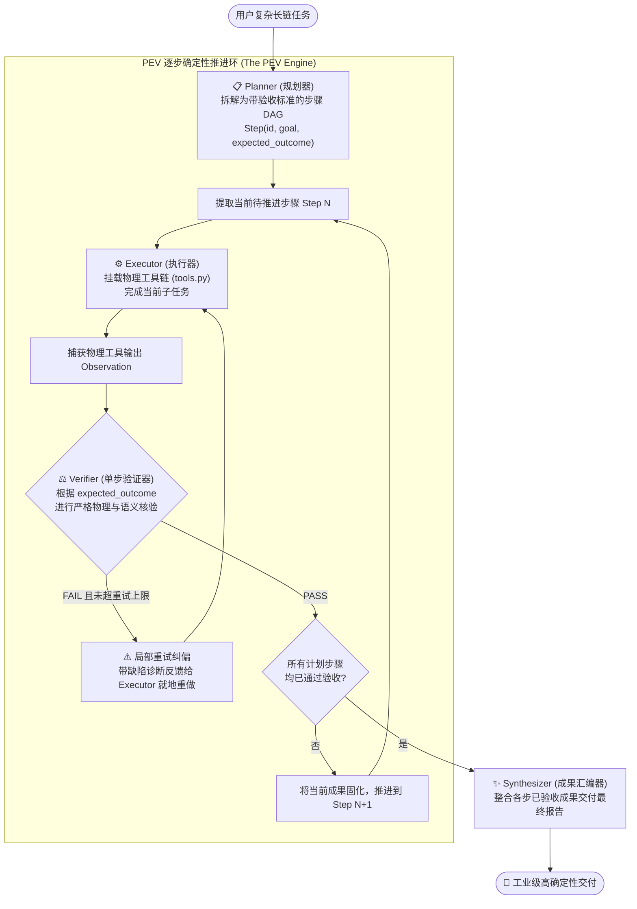

# Day 7 (原排期 Day 9) 架构精要：规划解耦与单步验收闭环 —— PEV (Plan-Execute-Verify) 架构

> **学习目标**：掌握现代复杂长链路智能体最核心的确定性架构 —— **PEV (Plan-Execute-Verify)**，深度剖析贪心搜索（ReAct）、全局规划（Plan-and-Solve）与单步验证（PEV）的本质差异，攻克长链条执行中的“雪崩效应”。

---

## 1. 为什么单纯的 Planning 很容易“全盘崩溃”？

在前面的学习中，我们认识了两种截然不同的范式：
- **ReAct**：**贪心局部搜索（Greedy Local Search）**，想一步做一步，走迷宫很强，但面对“重构一个大模块”这种需长线规划的任务时，容易走着走着就迷路；
- **Plan-and-Solve（纯规划架构）**：模型在最开始写下 1、2、3、4 步计划清单，然后按部就班一条条执行。

### 纯规划的致命软肋：**执行盲信与雪崩效应 (Error Cascading)**
```text
[Step 1] Planner: "在数据库中检索用户交易记录并保存为 CSV"
[Step 1] Executor 遇到权限不足，返回: "Access Denied: Cannot export CSV"
[Step 2] Planner 盲信第 1 步已完成，直接指示: "读取刚才导出的 CSV 并计算最大回撤"
[Step 2] Executor 面对不存在的文件，为了完成任务，开始【严重胡编乱造 NaN/虚假数据】！
[Step 3] 最终输出一份看似工整、实则完全由幻觉构成的毒性报告！
```
**核心病根**：Plain Planning 对每一步的执行结果**全盘盲信**，缺乏“质量门禁（Quality Gate）”。

---

## 2. PEV 架构的核心破局点：在“执行”与“采纳”之间插入 Verifier

**PEV (Plan-Execute-Verify)** 的精髓是：**拒绝盲信，每一小步都必须经过独立验收**！



### PEV 的三大设计要素：
1. **Explicit Expected Outcome（明确的单步验收条件）**：
   - 每一个 Step 不仅有“要做什么”，更必须明确“**做到什么程度算通过**”。
   - 例如：`Step 2: 读取 agent_memory.json`，其预期产出必须是 `包含非空 JSON 键值对，且包含 user_name 字段`。
2. **Per-Step Retry（就地局部重试）**：
   - 如果第 2 步失败，**绝对不推进到第 3 步**！
   - 针对当前步骤就地重试 1~2 次，把错误扼杀在局部，防止毒化全局。
3. **Bounded Context per Step（上下文步进隔离）**：
   - 执行第 3 步时，不需要把第 1 步的所有乱七八糟的中间工具报错全塞进去，只需提供前两步被 Verifier 验收通过的“干净产物”，彻底避免 Token 爆炸与上下文污染。

---

## 3. 三大主流范式横向全景对比

| 架构范式 | 决策时机 | 动作方式 | 验证机制 | 适用场景 |
| :--- | :--- | :--- | :--- | :--- |
| **ReAct** | 动态实时决策 | 边想边调工具 | 依赖模型自觉观察 | 探索型任务、运维排错、单点调研 |
| **Reflection** | 单次全量生成后 | 内部重构精炼 | Critic 拿着 Rubric 挑刺打分 | 算法设计、长文写作、代码审查 |
| **PEV** | **事前规划 + 逐步推进** | 针对子目标调工具 | **每步独立硬核验收 (Verifier Gate)** | **多阶段复杂工程、数据处理管线、长链条代码重构** |

---

## 4. 工业级启示

在 Claude Code、Devin 以及 SWE-bench 顶级 Agent 评测中：
- 纯 ReAct 往往在 10 步之后开始失焦；
- 而一旦引入 **PEV 的分阶段计划与每步验证（如“先定位文件 -> 跑复现测试验证失败 -> 修改代码 -> 跑测试验证通过”）**，复杂任务的最终达成率能直接从 $30\%$ 暴涨到 $80\%+$！
