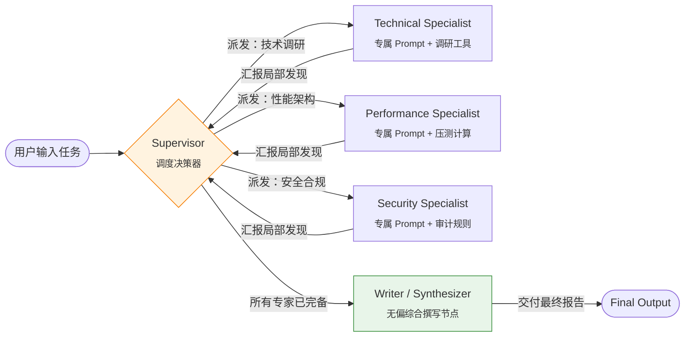

# Day 10 架构笔记：多智能体协作 —— Supervisor 星型路由 vs. Blackboard 黑板模式

> **核心命题**：当单一 Agent 的系统 Prompt 与上下文窗口无法承载跨领域的复杂任务时，多智能体系统（Multi-Agent Systems, MAS）如何组织协作？中心化主管（Supervisor）与去中心化黑板（Blackboard）的底层调度机制与工程权衡是什么？

---

## 1. 为什么单一通用 Agent 不足以为战？

在传统认知中，给一个大模型配备足够的工具和超长 Prompt 似乎可以解决一切问题。然而，在工业级 Agent Harness 工程中，单一通用 Agent 会迅速遭遇三大瓶颈：

1. **认知注意力的稀释与漂移（Context Dilution & Role Drift）**：
   - 强行要求一个 Agent 同时扮演财务精算师、资深架构师和安全审计员，模型在生成时往往会产生折中、泛化、缺乏深度的主观臆测。
   - 角色专属的 System Prompt 能够极大程度收敛模型解码阶段的搜索空间（Search Space）。
2. **工具爆炸与决策失焦（Tool Explosion）**：
   - 当工具集超过 10~20 个时，模型选择工具的错误率显著上升（Tool hallucination 或参数不匹配）。
   - 将工具按职责分配给特定专家（如：代码专家拥有 Shell/Diff 工具，调研专家拥有搜索/网页抓取工具），使各专家的决策集保持轻量可控。
3. **可观测性与归因隔离（Inspectability & Failure Isolation）**：
   - 单一长序列上下文发生事实性幻觉时，追溯是哪一步由于何种原因被误导极其困难。
   - 多智能体将任务切分为独立专家的有界输出，调试者可一眼定位是“调研专家采信了劣质信源”还是“分析专家做错了逻辑推演”。

针对多 Agent 的协作编排，业界演化出了两种经典范式：**中心化主管模式（Supervisor Pattern）** 与 **去中心化黑板模式（Blackboard Pattern）**。

---

## 2. 模式一：中心化主管模式（Supervisor + Specialists）

### 2.1 架构拓扑：星型结构（Star Topology）



### 2.2 核心协作协议（The Supervisor Protocol）

1. **结构化路由决策（Structured Decision Schema）**：
   主管模型不直接产出业务内容，而是产出具有强约束的调度指令：
   ```json
   {
     "next_agent": "technical",
     "reason": "技术选型细节尚未明确，需由技术专家梳理语言特性与并发模型"
   }
   ```
2. **防死循环安全锁（Safety Clamp）**：
   - **典型故障**：模型往往倾向于重复调用刚回答过的专家（注意力惯性），导致在同一个专家身上死循环。
   - **Harness 物理干预**：Harness 在状态机内部维护 `contributed_roles` 集合。若主管决策给出的专家已完成交付，Harness 将自动触发 **Safety Clamp**，强制将控制权平移给下一个未调用的专家；若全部专家均已完成，强制路由至 `writer`。
3. **独立的 Writer 节点（Why a Dedicated Writer?）**：
   - **规避近因效应（Recency Bias）**：如果让最后发言的专家写总结，报告往往会被该专家的语气和观点垄断。
   - **规避角色污染（Role Contamination）**：安全专家写的总结往往把整个系统描述成千疮百孔的灾难；性能专家写的总结则全篇充斥压测数据。独立的 Writer 拥有中立的综合 Prompt，专注整合论据并消解分歧。

---

## 3. 模式二：去中心化黑板模式（Blackboard Pattern）

### 3.1 理论渊源：HEARSAY-II (1980)

黑板模式最早由卡耐基梅隆大学（CMU）的 Erman 等人在 1976~1980 年开发 **HEARSAY-II** 语音识别系统时提出。在 HEARSAY-II 中，声学、音素、音节、词汇、句法等异构知识源（Knowledge Sources, KS）没有任何单一统摄者。所有知识源共同监控一块“黑板”，根据黑板上的最新假设自主评估能否推进求解。

### 3.2 架构拓扑：共享总线结构（Shared State Bus）

```mermaid
flowchart TB
    Task([用户输入任务]) --> BB[(Shared Blackboard<br/><sub>全局共享状态总线</sub>)]
    
    subgraph BiddingRound ["竞标仲裁循环 (Round N)"]
        BB -.->|广播黑板全貌| KS1[KS 1: 架构专家]
        BB -.->|广播黑板全貌| KS2[KS 2: 可靠性专家]
        BB -.->|广播黑板全貌| KS3[KS 3: 商业与成本]
        
        KS1 -->|Bid(意愿, 置信度, 预览)| ARB{机械仲裁器<br/><sub>Python Deterministic Max</sub>}
        KS2 -->|Bid(意愿, 置信度, 预览)| ARB
        KS3 -->|Bid(意愿, 置信度, 预览)| ARB
    end

    ARB -->|遴选最高置信度赢家| ACT[Winner Executes & Writes]
    ACT -->|追加条目 [Round N] KS: ...| BB
    
    BB -->|收敛退出：无中选者 或 达最大轮数| SYN[Synthesizer<br/><sub>全视角平衡综述</sub>]
    SYN --> Output([最终决策结论])

    style BB fill:#e1f5fe,stroke:#0288d1
    style ARB fill:#fff3e0,stroke:#f57c00
    style SYN fill:#e8f5e9,stroke:#388e3c
```

### 3.3 竞标与仲裁机制（Bidding & Arbitration Protocol）

1. **自省竞标（Self-Assessed Bidding）**：
   每个轮次开始时，每个知识源并行/串行读取当前黑板状态，提交出价契约：
   ```json
   {
     "will_contribute": true,
     "confidence": 4,
     "preview": "针对架构专家提出的 Goroutine 泄漏风险，提出基于 Context 级联取消与 Channel 泄漏检测的防御策略。"
   }
   ```
2. **确定性机械仲裁（Mechanical Python Arbiter）**：
   - **关键区别**：黑板模式**没有主管大模型**来挑选人选。仲裁完全由宿主程序（Python 原生代码）通过确定的数学公式完成：
     $$\text{Winner} = \arg\max_{ks \in \text{Eligible}} \left( \text{BidConfidence}(ks) - \text{Penalty}(ks) \right)$$
   - 若最高置信度低于阈值（如 $\text{min\_confidence} = 3$）或全员弃标（`will_contribute = false`），黑板自动收敛。
3. **垄断防范与公平衰减（Domination Deterrence）**：
   - **故障形态（The Domination Trap）**：部分自信心过强的大模型角色（如“乐观主义者”或“架构师”）倾向于每轮都出最高分（5 分），导致其他批判性角色永久饥饿，黑板沦为一言堂。
   - **双重抑制策略**：
     - **软提示（Soft Nudge）**：在出价 Prompt 中注入全员历史发言计数（`contributions_count`），明确要求发言 $\ge 2$ 次的专家主动礼让；
     - **硬惩罚（Hard Decay）**：在 Python 仲裁层，累计发言每多一次，有效出价置信度扣减 1 分（Confidence Decay）。

---

## 4. 架构全景对比：Supervisor vs. Blackboard

| 评估维度 | Supervisor 模式 | Blackboard 黑板模式 |
| :--- | :--- | :--- |
| **控制拓扑** | 中心化（星型 Hub-and-Spoke） | 去中心化（共享状态总线 Shared Bus） |
| **决策权力** | 主管 LLM 决定下一步由谁执行 | 各专家自主评估，Python 仲裁胜出者 |
| **单轮开销** | **低（2 次 LLM 调用）**：主管决策 + 专家执行 | **高（N+1 次 LLM 调用）**：N 个专家竞标 + 1 个赢家写入 |
| **动态增删专家** | 较弱（需重新生成 Supervisor 路由枚举） | **极强（解耦）**：随时挂载新知识源，无需更改任何调度 Prompt |
| **协作模式** | 预定编排、工单流转、确定性推进 | 机会主义、突发灵感、多视角对抗博弈 |
| **收敛特性** | 主管判定 `writer` 或 `FINISH`，收敛迅速 | 依赖出价衰减或置信度自然归零，易产生冗余讨论 |
| **最适业务场景** | 研报撰写、分工明确的流水线、代码重构 | 疑难故障排查（RCAs）、头脑风暴、多学派争鸣评审 |

---

## 5. 工业级 Harness 实战思考

在现代 AI Coding Harness（如 Claude Code 或 OpenAI Codex 环境）中：
1. **Claude Code 采用的是精简版 Supervisor-Subagent 模式**：主 Agent 作为 Supervisor，遇到大型搜索或探索时通过 `invoke_subagent` 派发子进程，拿到报告后收回主线。
2. **黑板模式的现代演变 —— Issue/PR 协同总线**：在多个专用 Agent（代码生成 Agent、单元测试 Agent、代码审查 Agent、静态分析 Agent）协同作业时，GitHub Issue 或 PR Thread 本质上充当了一块跨时空的**异步黑板（Persistent Blackboard）**，各 Agent 监听状态变动并自主触发。
