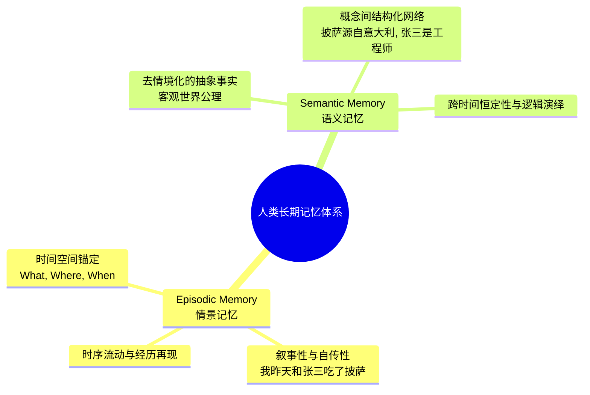
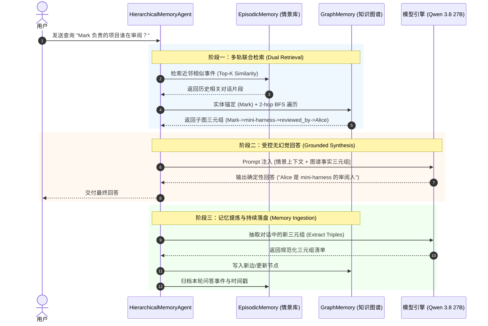

# Day 11 架构笔记：分层记忆体系 —— Episodic 情景记忆、Semantic 语义记忆与 Graph 知识图谱

> **核心命题**：大模型的上下文窗口（Context Window）是昂贵且易失的工作内存（Working Memory）。当 Agent 需要跨越天、周乃至月与人类或复杂系统进行持续交互时，如何构建持久化、可演进的分层记忆体系？向量检索与知识图谱的底层边界与协作模式是什么？

---

## 1. 理论根基：认知科学中的 Tulving 双轨记忆模型 (1972)

1972 年，加拿大认知心理学家 Endel Tulving 提出了人类长期记忆（Long-term Memory）的经典分类：

在大模型智能体（LLM Agents）工程中，这两种记忆模式直接映射到两套截然不同的数据结构：
1. **情景记忆（Episodic Memory）**：
   - 存储具体的交互事件、对话日志、工具调用历史快照（带有 Timestamp 与上下文元数据）。
   - **典型检索提问**：“我们上周讨论过关于 Docker 部署的事情吗？”、“我之前提到的那个报错最后是怎么解决的？”
2. **语义记忆（Semantic Memory / Graph Memory）**：
   - 从历史情景中抽取出来的结构化概念网络，以 `(Subject, Predicate, Object)` 三元组（Triples）形式组织在有向知识图谱（Knowledge Graph）中。
   - **典型检索提问**：“Mark 的技术栈有哪些？”、“模块 A 的下游依赖服务是谁？”、“谁负责审批 Alice 的代码？”

---

## 2. 三层记忆载体全景对比

现代工业级 Agent 绝非仅靠单一的“向量数据库（Vector DB）”就能打天下，必须划分清晰的生命周期分层：

| 记忆层级 | 物理载体 | 存活周期 | 检索机制 | 典型容量与开销 | 核心作用 |
| :--- | :--- | :--- | :--- | :--- | :--- |
| **Working Memory (工作记忆)** | LLM Context Window (Prompt) | 单次请求 / 当前会话轮次 | 内部 Self-Attention 全局注意力 | 8K ~ 128K Tokens, 成本最高 | 维持当前的推理上下文与即时工具调用 |
| **Episodic Memory (情景记忆)** | 时间序文本日志 / 向量数据库 (FAISS / 余弦索引) | 跨会话永久留存 | 语义相似度搜索 (Cosine Sim) + 时间衰减 | 数万条事件，毫秒级检索 | 找回历史相似经历，提供上下文案例 (Few-shot) |
| **Semantic / Graph Memory (语义/图记忆)** | 知识图谱 (Adjacency Graph / Neo4j) | 跨系统永久留存 | 实体锚定 (Entity Linking) + N-hop 图遍历 | 实体与边关系网络，纯确定性运算 | 维持客观世界模型，支持多跳关系演绎推导 |

---

## 3. 为什么“纯向量检索 (Vector RAG)”在复杂记忆中会遭遇死穴？

大量初级 Agent 架构试图“把所有聊天记录切块存进 Vector DB，查的时候做 Top-K 召回”。在生产环境下，这种做法有两大致命死穴：

### 3.1 死穴一：无法处理“多跳关系推导（Multi-hop Relational Reasoning）”
* **场景**：
  - 事实 1：*Mark 负责开发核心网关系统 Gateway。*
  - 事实 2：*Gateway 的生产环境部署在 Kubernetes 集群 K8s-Prod。*
  - 事实 3：*K8s-Prod 的运维负责人是 Bob。*
* **用户提问**：“Mark 负责的项目的生产集群负责人是谁？”
* **向量检索的表现**：
  - 问题文本计算出的 Embedding 向量与事实 1、事实 2、事实 3 的相似度都处于不高不低的边缘状态，极易召回毫不相干的其它含“Mark”或“负责人”的噪音切片，导致 LLM 发生事实性拼接幻觉。
* **图谱遍历（Graph Traversal）的表现**：
  - 实体匹配：锚定起始节点 `Mark`；
  - 1-hop 遍历：`Mark --[develops]--> Gateway`；
  - 2-hop 遍历：`Gateway --[deployed_on]--> K8s-Prod`；
  - 3-hop 遍历：`K8s-Prod --[maintained_by]--> Bob`；
  - **确定性命中答案**：Bob。没有任何幻觉空间。

### 3.2 死穴二：高频相似实体的“语义混淆（Semantic Confusion）”
向量检索本质上是**模糊概率匹配**。如果知识库中有 20 个项目名称，向量无法区分精确的外键对应关系，而图谱通过有向边严格隔离实体的属性归属。

---

## 4. 为什么“纯图谱 (Graph-only)”同样不完备？

图谱的优势在于**结构化关系**，但其劣势同样极为致命：
1. **叙事与时序信息剥离**：知识图谱表达的是静态事实。一旦关系发生动态更替（如张三以前在 A 组，后来换到了 B 组），图谱的时态建模（Temporal Knowledge Graph）极其复杂脆弱。
2. **非结构化细节丢失**：用户对话中的情感倾向、讨论过程中的权衡理由、未形成定论的探索性想法，根本无法压缩成简单的 `(s, p, o)` 三元组。

> **结论**：**Episodic + Graph 双轨协作** 是解决长程记忆的唯一解。情景记忆保留原始交互血肉，图谱记忆提炼结构化骨架。

---

## 5. 端到端双轨记忆调度时序

---

## 6. 工业级陷阱与 Harness 防御策略

1. **谓词碎片化（Predicate Fragmentation）**：
   - **故障**：模型在抽取三元组时，自由发挥输出 `("Mark", "works_at", "Google")`、`("Bob", "is_employed_by", "Google")`、`("Alice", "employee_of", "Google")`。
   - **危害**：同一个关系产生了 3 条不同的边，导致图谱断裂无法合并。
   - **防御策略**：在三元组提取 Schema 中严格规范化，要求谓词必须使用小写下划线常用动词集合（如 `works_at`, `maintains`, `depends_on`, `reviews` 等），并在写入图谱前做同义词归一化清洗。
2. **实体漂移（Entity Drift）**：
   - **故障**：`OpenAI`、`OpenAI Inc`、`openai` 被当作 3 个不同的独立节点。
   - **防御策略**：节点名称强制进行 `strip().lower()` 预处理，并支持简单别名映射（Alias Mapping）。
3. **N-hop 噪音爆炸（Graph Noise Flooding）**：
   - **故障**：检索时若盲目遍历 3-hop 或 4-hop，可能会拉出全图 80% 的节点，直接挤爆 Context Window。
   - **防御策略**：工程上严格限制默认检索深度为 **1~2 hop**，并以起始匹配实体的度数（Degree）进行反向权重惩罚。
