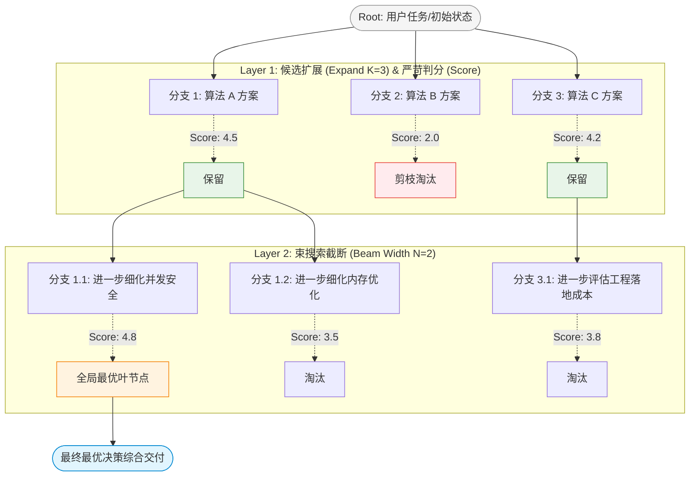
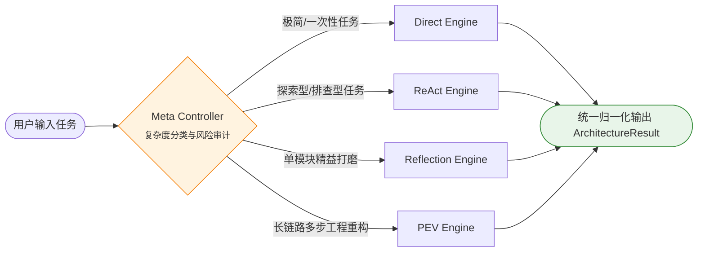

# Day 12 架构笔记：动态决策流 —— Tree of Thoughts (思维树) 与 Meta Controller (架构元控制器)

> **核心命题**：静态线性的 Prompt 编排与单一固定的 Agent 拓扑无法适应现实世界的动态工程需求。如何在微观上实现**可回溯、多分支竞争的思维树搜索（Tree of Thoughts）**？在宏观上如何构建**依据任务形状与复杂度自动调度最适架构的元控制器（Meta Controller）**？

---

## 1. 微观决策跃迁：从 Chain-of-Thought 到 Tree of Thoughts

### 1.1 传统 CoT 的“单向赌徒陷阱”

普通的思维链（Chain-of-Thought, CoT）本质上是一种**不可回溯的贪心单向解码（Greedy Search）**：

$$\text{Task} \to \text{Step}_1 \to \text{Step}_2 \to \text{Step}_3 \to \text{Answer}$$

* **致命缺陷（Commitment Bias）**：
  大模型在第一步（$\text{Step}_1$）一旦作出了次优假设或错误推导，自回归注意力机制会在后续步骤中把错误当成既定前提，不断自圆其说。系统缺乏任何“反思并回滚到分叉路口重试”的物理机制。

### 1.2 Tree of Thoughts (ToT) 搜索拓扑

Yao 等人（NeurIPS 2023）提出的 Tree of Thoughts 将推理过程从“单线叙事”重构为**基于显式树状状态空间的束搜索（Beam Search）**：



### 1.3 ToT 核心四大算子（The 4 Search Operators）

1. **思维分支生成（Thought Expansion, $K$ 分支）**：
   在当前前沿节点上，Prompt 必须**显式强制要求多元视角**（如：“提出 3 种完全不同的技术路线，严禁同义反复”）。
2. **客观状态判分（Thought Evaluation / Scoring）**：
   由独立的 Evaluator（温度 $\le 0.2$）对照客观标准打分（1~5 分）并输出理由。
   > **避坑关键**：严禁“老好人评估器（Lenient Evaluator）”。如果每个分支都打 5 分，Beam Search 将瞬间退化为无意义的指数暴力穷举。
3. **束搜索剪枝（Beam Pruning, $N$ 宽度）**：
   每层仅保留累计得分最高的 Top-$N$ 个节点，物理抹杀低分节点，收敛搜索空间。
4. **终局路径综合（Final Path Synthesis）**：
   沿根节点追踪到最优叶节点的完整决策轨迹，产出最终高可靠性方案。

---

## 2. 宏观调度跃迁：Meta Controller (架构元控制器)

### 2.1 “没有银弹”：架构选型的权衡真相

在工业级 Agent 体系中，没有任何单一架构能够包打天下：

```text
计算成本 / 延迟 / Token 消耗:
Direct (1x)  <<  ReAct (3-5x)  <<  Reflection (3-6x)  <<  PEV (6-15x)  <<  Multi-Agent / ToT (20-40x)
```

| 架构形态 | 最佳匹配场景 (Sweet Spot) | 错误应用灾难 (Anti-Pattern) |
| :--- | :--- | :--- |
| **Direct / One-shot** | 确定性代码格式化、简单概念问答、单工具调用 | 用于复杂长链路重构 $\to$ 必出幻觉 |
| **ReAct** | 信息检索未知、依赖多次排查工具的调查型任务 | 用于严格工程修改 $\to$ 容易陷入死循环 |
| **Reflection** | 重点关注单一输出物质量的场景（如高并发算法、核心库函数编写） | 用于跨文件状态迁移 $\to$ 空谈误国 |
| **PEV (Plan-Execute-Verify)** | 多步骤、跨文件、包含物理依赖的大型任务（如环境迁移、数据库重构） | 用于简单计算 $\to$ 极度浪费 Token 和耗时 |

### 2.2 Meta Controller 架构拓扑：统一多态总线



### 2.3 动态决策契约（Structured Routing Contract）

元控制器模型不输出业务回答，而是输出受强类型约束的调度决策：
```json
{
  "chosen_arch": "pev",
  "reason": "任务涉及多步骤代码修改与物理单元测试验证，需要严格的计划拆解与门禁验收防雪崩。",
  "complexity_level": "high",
  "estimated_budget_calls": 8
}
```

### 2.4 工业级映射：Claude Code / Cursor 的真实路由策略
现代 AI Coding CLI（如 Claude Code）的命令入口其实就是一个微型的 Meta Controller：
1. **轻量命令（`commit`, `diff`）** $\to$ 走极速单次 Tool Call；
2. **只读探索（`search`, `find`）** $\to$ 走类似 ReAct 的只读循环；
3. **架构重构（`implement feature X`）** $\to$ 走类似 PEV 的分步规划与测试验证。

---

## 3. 本日工程实现与参数约束

在本地 `qwen/qwen3.8-27b` 的推理环境中：
* **ToT 参数纪律**：
  - `branching (K) = 3`
  - `beam_width (N) = 2`
  - `max_depth (D) = 2`
  - 单次完整树搜索控制在 8~10 次 LLM 调用内，在保证多路径分歧与剪枝效果的同时，避免推理时间过长。
* **Meta Controller 调度闭环**：
  - 动态集成前面手写的 `day03_react_loop.py`、`day08_reflection.py`、`day09_pev.py`；
  - 验证对简单问题、质量敏感问题与长链路工程问题的分流准确率。
