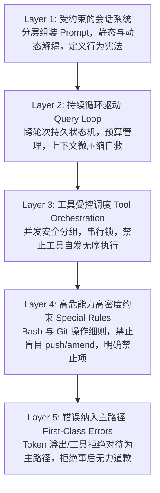

# Day 15: 驾驭工程哲学与 Prompt 控制面状态机 (Harness Engineering & Prompt-as-Control-Plane)

> **学习模块**：Week 3 工业级蜕变 —— 驾驭工程与系统防御 (Claude Code Harness Engineering)  
> **核心参考**：`harness-books/book1-claude-code` 第 1 章（为什么需要 Harness）与第 2 章（Prompt 是控制平面）  
> **源码对应**：[day15_control_plane.py](file:///Users/mark/GitHub/agent-architect-lab/mini-harness/src/day15_control_plane.py) | [day15_test.py](file:///Users/mark/GitHub/agent-architect-lab/mini-harness/src/day15_test.py)  

---

## 1. 核心哲学：“模型是引擎，Harness 是车身”

在过去的技术认知中，很多人倾向于将智能体能力的提升全部寄希望于大模型（LLM）本身的“智商”或“涌现”。但在进入真实软件工程场景后，这一假设立刻面临严酷的现实挑战：

```text
       ┌────────────────────────────────────────────────────────┐
       │                   Harness (车身控制系统)                │
       │  ┌────────────────┐ ┌────────────────┐ ┌────────────┐  │
       │  │  Prompt 控制面  │ │ 权限阻断/审批  │ │ 上下文压缩 │  │
       │  └────────┬───────┘ └───────┬────────┘ └──────┬─────┘  │
       │           │                 │                 │        │
       │           ▼                 ▼                 ▼        │
       │       ┌────────────────────────────────────────┐       │
       │       │        LLM 推理核心 (V8 引擎发动机)     │       │
       │       │    (高动力、概率分布输出、不天然可信)   │       │
       │       └────────────────────────────────────────┘       │
       │           ▲                 ▲                 ▲        │
       │           │                 │                 │        │
       │  ┌────────┴───────┐ ┌───────┴────────┐ ┌──────┴─────┐  │
       │  │ 工具并发调度器 │ │ 崩溃恢复/回滚  │ │ 物理门禁箱 │  │
       │  └────────────────┘ └────────────────┘ └────────────┘  │
       └────────────────────────────────────────────────────────┘
```

> **核心判断**：
> **一个会说话的概率分布，一旦能够接触 Shell、Git、网络和本地文件系统，问题就从“回答得不够好”彻底演变成“执行造成实际破坏”。**  
> 模型绝不是天然值得信任的。Harness Engineering（驾驭工程）的本质，就是把这样一个高动力却不稳定的发动机，用一套精密、制度化的机械车身（底盘、刹车、转向机、防滚架）约束成一个安全可控的工业生产系统。

---

## 2. Claude Code 的五层 Harness 防御体系

从 Claude Code 源码架构拆解，可以清晰提炼出五层严密的防御边界：



1. **第一层（约束会话）**：System Prompt 不是一段随意的人物背景，而是由多个独立职责的区块（身份、权限说明、工程纪律、记忆索引）分层组装而成的**运行时规约**。
2. **第二层（持续循环）**：运行依赖跨轮次的状态机（`messages`、`token budgets`、`turn counts`、`compaction tracking`），上一轮留下的问题受控进入下一轮。
3. **第三层（工具受控调度）**：工具调用必须由调度器决定是并行还是串行（`partitionToolCalls` + `isConcurrencySafe`），环境变更必须按顺序回放。
4. **第四层（高危工具深度防线）**：针对 Bash 这一几乎无边界的高危接口，配置数十条工程硬约束（不要跳过 git hooks、不要盲目 git add、不要破坏原有配置）。
5. **第五层（错误属于主路径）**：把上下文超限、工具超时、单测挂掉当作常态化事件处理，建立结构化自愈与降级闭环，坚决不靠临场发挥。

---

## 3. 控制平面三条硬约束不变式 (Invariants)

任何成熟的 Harness 系统，必须在运行时保持以下三条控制公理：

```python
# 不变式 1: 提示词来源必须分层清晰，身份不可与运行时临时状态混淆
assert prompt.layers >= {"default", "project", "custom", "agent", "append"}

# 不变式 2: 任何工具执行前，并发与安全性必须由调度器先裁决
assert all(scheduler.decides_concurrency(t) for t in pending_tool_calls)

# 不变式 3: 任何可恢复错误，必须存在确定的恢复分支或干净退出，禁止直接静默吞噬
assert on_recoverable_error in {"recover", "terminate_clean"}
```

---

## 4. Prompt 不是人设，Prompt 是控制平面与宪法

在聊天机器人中，Prompt 是“台词”（给角色看的）；在 Coding Agent 中，**Prompt 是“宪法”**（规定各方权力边界、责任分配与违规制裁）。

### ① 严格的来源优先级装配链 (Precedence Chain)
在 Claude Code (`src/utils/systemPrompt.ts`) 中，Prompt 绝对不是“谁后写谁生效”的黑盒文本，而是定义了硬编码的装配流水线：

```text
+-------------------------+  (最高优先级: 运行时强行覆盖)
|  override system prompt |
+------------+------------+
             | (若为空则回退)
             v
+------------+------------+
| coordinator sys prompt  |
+------------+------------+
             | (若为空则回退)
             v
+------------+------------+
|    agent system prompt  |
+------------+------------+
             | (若为空则回退)
             v
+------------+------------+
|   custom system prompt  |
+------------+------------+
             | (若为空则回退)
             v
+------------+------------+  (基线兜底: 默认工程纪律)
|   default system prompt |
+------------+------------+
             |
             +-----------------------+
             |  proactive_mode 特例  | (叠加模式: default + agent)
             +-----------------------+
             |
             v
+------------+------------+  (尾部固定挂载)
|   appendSystemPrompt    |
+-------------------------+
```

### ② 缓存感知边界（Prefix Cache Boundary）
在大规模调用中，Prompt 不仅仅是文本，更是**直接的经济成本与首字延迟（TTFT）**。如果每一轮会话都把动态时间戳或临时状态拼在 Prompt 最开头，会导致大模型服务商的 **KV Prefix Cache 全部失效**，导致延迟和 Token 费用暴增数倍。

Claude Code 将 Prompt 区块划分为两类：
- **静态可缓存块 (`systemPromptSection`)**：系统身份、工具契约、工程红线、项目规范（`CLAUDE.md`）。在多次请求中保持完全一致，前缀缓存命中率 95%+。
- **动态防击穿块 (`DANGEROUS_uncachedSystemPromptSection`)**：当前环境时间、临时工作区脏状态、Scratchpad 等每轮变化的内容，**必须严格限制在 Prompt 尾部或 User 消息末尾**，绝不能破坏前缀静态缓存。

---

## 5. 项目级指令 (`CLAUDE.md`) 与记忆治理 (`MEMORY.md`)

Claude Code 将上下文治理分为两个不同维度的规范：
1. **`CLAUDE.md`（项目宪法）**：规定项目的构建指令、单测命令、代码规范、架构红线。由人类开发者编写，Agent 开机即注入。
2. **`MEMORY.md`（知识治理）**：规定 Agent 自身沉淀的跨会话记忆，明确要求：
   - 记忆文件只存事实，不存短期计划（Task/Plan 不是 Memory）；
   - 包含文件级索引与 Frontmatter 元数据；
   - 必须有自检机制，防止模型无休止往记忆里堆砌垃圾日志。

---

## 6. 总结：工业级 Agent 的分水岭

| 对比维度 | 玩具级/普通对话 Prompt | 工业级 Agent 控制平面 (Harness) |
| :--- | :--- | :--- |
| **设计目标** | 让模型像一个聪明、有礼貌的伙伴 | 约束模型的行动边界，防止物理破坏 |
| **装配方式** | 单一长文本字符串直接拼接 | 模块化分段装配，严格遵循优先级链 |
| **缓存策略** | 忽视前缀缓存，随手塞入时间变量 | 严格划分 Static Cacheable 与 Dynamic 尾部边界 |
| **错误处理** | 模型在回答中说“对不起我错了” | 运行时错误状态机拦截，调度降级与快照回滚 |
| **环境信任** | 假设模型写出的代码都是对的 | **假设模型不可信，必须经物理测试与沙箱裁决** |
