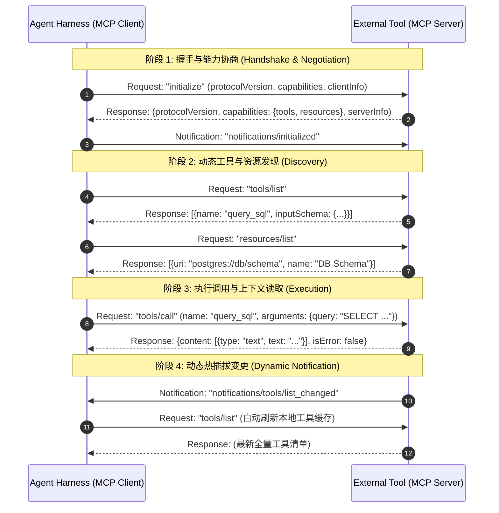

# Phase 5 专题 3：MCP 2.0 工业协议生态与工具动态发现

> **定位**：解构由 Anthropic、OpenAI 及工业界开源生态所共同推进的 **Model Context Protocol (MCP 2.0)** 标准。深入分析客户端-服务端协议总线、STDIO/SSE 传输层分帧、双向握手与能力协商（Handshake & Capability Negotiation）、工具与资源动态发现机制，以及在多智能体 Harness 中的安全拦截与多模态浏览器（Computer Use / Playwright）环境操作契约。

---

## 1. 为什么工业级 Agent 必须拥抱 MCP 2.0？

在早期 LLM 代理（如 ReAct 或 OpenAI Function Calling 初始实现）中，工具接入存在严重的**架构碎片化**与**代码侵入性**问题：
1. **私有接口孤岛**：LangChain Tools、CrewAI Tools、AutoGen Tools 各自定义了一套抽象基类，开发者必须为每个框架编写专有适配器。
2. **静态耦合与冷重启**：当宿主 Agent 启动时，所有可用工具必须在启动前编译或注册到内存中。若新增、修改外部数据源（如增加数据库表、切换 API 端点），必须重启整套 Agent 运行时。
3. **安全沙箱穿透**：传统工具多以动态 Python 函数直接运行在宿主 Agent 进程内，极易遭遇命令注入、内存污染或凭证泄露。

```mermaid
flowchart LR
    subgraph Legacy["传统私有工具接入 (碎片化与硬编码)"]
        A1["Agent Core"] -->|侵入式代码集成| T1["LangChain Tool (In-Process)"]
        A1 -->|专有结构适配| T2["AutoGen Tool (In-Process)"]
        A1 -->|硬编码 Python 脚本| T3["Raw Shell Function"]
    end

    subgraph MCP2["现代 MCP 2.0 标准总线 (解耦与动态发现)"]
        B1["Agent Core / Harness"] <==>|JSON-RPC 2.0 协议通道\n(STDIO / SSE)| M1["MCP Client"]
        M1 <==>|标准协议总线| S1["MCP Server (PostgreSQL)"]
        M1 <==>|动态工具发现| S2["MCP Server (Browser / Playwright)"]
        M1 <==>|安全沙箱隔离| S3["MCP Server (Git / Filesystem)"]
    end
```

**MCP 2.0 的核心价值**：
- **客户端与服务端完全解耦**：Agent Harness 充当 **MCP Client**，外部数据源和系统环境封装为独立的 **MCP Server**（可通过独立子进程、Docker 容器或跨网络远程微服务托管）。
- **统一通信协议**：基于标准的 **JSON-RPC 2.0** 报文交互，天然语言无关（Python/TypeScript/Rust 等随意混合编写）。
- **运行时动态发现与热插拔**：Client 能够在不中断对话的前提下，动态列举工具清单（`tools/list`）、订阅工具变更通知（`tools/list_changed`），实现零重启热加载。

---

## 2. 协议基础：JSON-RPC 2.0 通信契约

MCP 协议全面规范在 JSON-RPC 2.0 基础之上。通信双方通过单行或分帧的 JSON 报文进行全双工消息交互。

### 2.1 四类核心报文规范

#### ① 请求报文 (Request)
客户端向服务端（或服务端向客户端反向采样）发起调用，**必须包含唯一标识 `id`**：
```json
{
  "jsonrpc": "2.0",
  "id": 1001,
  "method": "tools/call",
  "params": {
    "name": "browser_navigate",
    "arguments": {
      "url": "https://example.com"
    }
  }
}
```

#### ② 响应报文 (Response)
调用成功返回 `result`，且其 `id` 与对应请求严格一致：
```json
{
  "jsonrpc": "2.0",
  "id": 1001,
  "result": {
    "content": [
      {
        "type": "text",
        "text": "Navigated to https://example.com successfully. Page title: Example Domain"
      }
    ],
    "isError": false
  }
}
```

#### ③ 错误报文 (Error Response)
当调用失败或协议异常时，返回包含标准错误码的 `error` 对象：
```json
{
  "jsonrpc": "2.0",
  "id": 1001,
  "error": {
    "code": -32601,
    "message": "Method not found: tools/call_invalid",
    "data": null
  }
}
```
*标准错误码表*：
- `-32700`: Parse error (JSON 语法解析失败)
- `-32600`: Invalid Request (非法请求体结构)
- `-32601`: Method not found (方法不存在)
- `-32602`: Invalid params (参数格式或 Schema 不匹配)
- `-32603`: Internal error (服务端内部执行异常)

#### ④ 单向通知报文 (Notification)
单向广播事件，**绝不包含 `id` 字段**，接收方不得做任何响应回复：
```json
{
  "jsonrpc": "2.0",
  "method": "notifications/tools/list_changed",
  "params": {}
}
```

---

## 3. 传输层拓扑：STDIO vs SSE

MCP 协议支持多种物理与逻辑传输层通道（Transports），各具应用场景：

```mermaid
flowchart TD
    subgraph STDIO["1. 本地标准 I/O 管道 (STDIO Transport)"]
        A["Agent Harness (Parent Process)"] <-->|stdin (line-delimited JSON)| B["MCP Server Process (Child Process)"]
        A <-->|stdout (line-delimited JSON)| B
        A -.->|stderr (Log / Debug Stream)| C["Telemetry / Logger"]
    end

    subgraph SSE["2. 远程网络长连接 (HTTP + SSE Transport)"]
        D["Agent Harness (HTTP Client)"] -->|POST /messages (JSON-RPC Requests)| E["MCP Server (Remote Gateway)"]
        E -->|SSE Stream /events (Server-Sent Events)| D
    end
```

### 3.1 本地 STDIO Transport (默认首选)
- **机制**：Agent 宿主通过 `subprocess.Popen` 启动服务端独立子进程，重定向其 `stdin` 与 `stdout` 管道。
- **协议分帧**：消息采用以换行符（`\n`）分隔的 UTF-8 JSON 文本流。
- **天然隔离性**：子进程与 Agent 宿主内存隔离。若 MCP Server 崩溃或出现内存越界，子进程退出不影响宿主稳定性；同时 `stderr` 单独作为监控日志捕获。

### 3.2 远程 SSE (Server-Sent Events) Transport
- **机制**：客户端建立到服务器的 HTTP SSE 长连接接收通知与响应，同时通过 HTTP POST 发送客户端请求。
- **场景**：适用于跨团队共享的云端数据网关、集群只读资源池或有独立鉴权网关的企业级 MCP 服务。

### 3.3 进程内 In-Memory / Simulated Transport
- **机制**：基于内存中的线程安全双向消息队列或异步管道（Queue / Event），适用于高频微内核集成、纯标准库环境及高确定性单元测试。

---

## 4. MCP 生命周期与交互时序

MCP Client 与 Server 的交互遵循严格的协议状态机生命周期：



### 4.1 阶段 1：握手与能力协商 (Initialize)
1. 客户端发起 `initialize`，宣示支持的最高协议版本（如 `"2024-11-05"`）以及客户端能力（如是否支持采样 `sampling`、工作区根目录 `roots`）。
2. 服务端响应其名称、版本与服务端能力：
   ```json
   {
     "capabilities": {
       "tools": {"listChanged": true},
       "resources": {"subscribe": false, "listChanged": true},
       "prompts": {"listChanged": false}
     },
     "serverInfo": {"name": "filesystem-mcp-server", "version": "1.0.0"}
   }
   ```
3. 客户端发出 `notifications/initialized`，双方状态机进入就绪（READY）状态。在收到确认前，不得发送业务请求。

### 4.2 阶段 2：动态发现 (Discovery)
- **`tools/list`**：返回所有可用工具及其标准的 JSON Schema 参数约束定义。Harness 可据此即时组装为大模型所要求的 Function Calling Payload。
- **`resources/list` & `resources/read`**：提供结构化的只读外部上下文（例如静态文档、日志文件、配置数据库）。Agent 可根据 URI 动态将资源挂载至系统上下文。

### 4.3 阶段 3：执行调用 (Execution)
- 客户端发送 `tools/call`，指定 `name` 和 `arguments`。
- 服务端返回标准化的 `content` 数组（支持 `type: "text"` 或 `type: "image"`），以及布尔型 `isError` 状态。

### 4.4 阶段 4：动态变更通知 (Dynamic List Changed)
当服务端动态装载了新插件，或发生配置热重载时，服务端主动推送 `notifications/tools/list_changed`。客户端监听此通道并自动发起 `tools/list` 静默更新缓存，**实现运行时零重启热扩展**。

---

## 5. 安全防御：Agent Harness 中的 MCP 拦截体系

MCP 的开放性带来了极高的扩展性，但也放大了安全暴露面。工业级 Harness 绝不能对 MCP 工具结果盲目信任，必须设立三道防御关卡：

```mermaid
flowchart TD
    A["LLM Tool Call 意图"] --> B["关卡 1: Schema 强类型与字段注入校验"]
    B -->|校验通过| C["关卡 2: SafeGuard 敏感指令与路径遍历拦截"]
    C -->|高危操作 (如 DROP / rm -rf)| D{"关卡 3: 人在回路 (HITL) 授权确认"}
    D -->|用户批准| E["MCP Client 打包 JSON-RPC 报文"]
    D -->|用户拒绝| F["熔断阻断并反馈 PermissionDeniedError"]
    C -->|常规安全操作| E
    E --> G["MCP Server 沙箱内隔离执行"]
    G --> H["结果返回与大小/截断保护 (Truncation Guard)"]
    H --> I["进入 Agent 会话上下文"]
```

1. **Schema 校验器 (Schema Guard)**：防止模型输出幻觉参数或恶意构造的字段注入；
2. **敏感操作防护 (Permission Guard)**：结合前述 Phase 3 / Week 4 的 `SafeBashGuard`，检测 SQL 注入、系统目录非法读写等；
3. **熔断与超时治理**：为每个 MCP 请求设定严苛的超时时限（如 10s），防止外部进程无响应导致整个 Harness 死锁。

---

## 6. 生产要素探索：MCP 模式下的多模态浏览器操作 (Computer Use)

在复杂的真实业务中，Agent 往往需要操作浏览器抓取动态网页、填写表单或自动化测试。在 MCP 2.0 规范下，浏览器能力被规范化为一套标准 MCP 工具族（以 Playwright / Headless Chrome 为底层支撑）：

| 工具名称 | 输入参数 (Schema) | 返回内容 | 核心能力描述 |
| :--- | :--- | :--- | :--- |
| `browser_navigate` | `{ "url": str }` | `TextContent` | 打开目标网页并返回状态码与页面标题 |
| `browser_screenshot` | `{ "full_page": bool }` | `ImageContent (base64)` | 捕获当前视口或全页面图像，支持多模态视觉模型感知 |
| `browser_click` | `{ "selector": str }` | `TextContent` | 定位页面 CSS / XPath 元素并模拟用户点击事件 |
| `browser_extract_text`| `{ "selector": Optional[str] }` | `TextContent` | 清洗提取 DOM 树文本，自动过滤无用广告与 HTML 噪声 |

通过将浏览器封装为 MCP Server，Agent 无需在主线程中操心 Playwright 浏览器进程的并发启动、Cookie 共享与视口配置，而是统一通过 `tools/call` 进行抽象调用，实现了真正的基础设施与控制面解耦。
