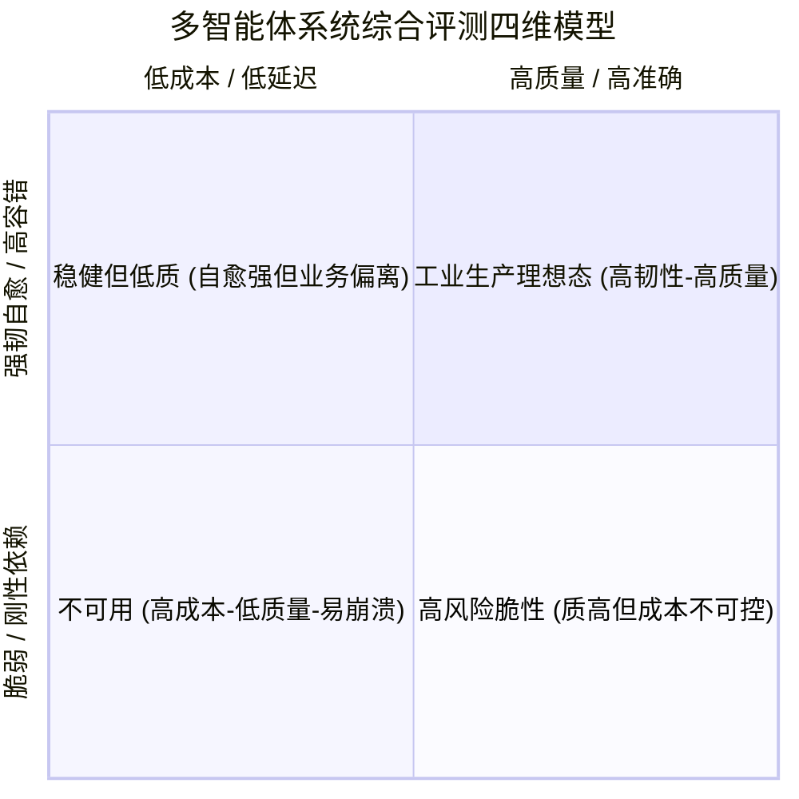
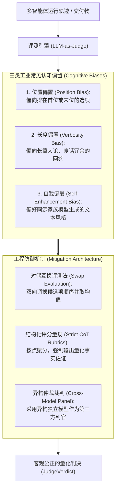

# Phase 5 专题 4：多智能体协作量化评测体系与 LLM-as-Judge 工业实践

> **定位**：系统解构多智能体系统（Multi-Agent System, MAS）的量化评测方法论。深入分析多智能体相较于单体 Agent 在状态空间爆炸、交互非确定性与错误级联归因上的评测瓶颈，建立涵盖“任务达成度、协作冗余度、算力耗时归因、自愈鲁棒性”的四维量化指标体系，剖析 LLM-as-Judge 核心架构与三大认知偏置（位置偏置、长度偏置、自我偏爱）防范方案，并沉淀拓扑消融（Ablation Study）基准对比方法。

---

## 1. 范式转移：为什么单体评测方法在多智能体中彻底失效？

在传统的单体 Agent 评测（如 SWE-bench、HumanEval、ToolBench）中，通常假设输入输出存在确定性边界，评价核心聚焦于：*“最终生成代码是否跑通单元测试”* 或 *“Function Calling 参数是否与标准答案完全一致”*。

然而，一旦进入**多智能体系统（MAS）**，评测复杂度呈现几何级攀升：

```mermaid
flowchart TD
    subgraph SingleAgent["传统单体 Agent (单线性链路)"]
        S1["User Prompt"] --> S2["ReAct Loop (Single Model)"]
        S2 --> S3["Final Output"]
        S3 --> S4["Unit Test Pass/Fail (Deterministic)"]
    end

    subgraph MultiAgent["多智能体协作系统 (网状非确定性)"]
        M1["Complex Goal"] --> M2["Orchestrator / Router"]
        M2 <--> M3["Specialist Agent A (Coder)"]
        M2 <--> M4["Specialist Agent B (Reviewer)"]
        M3 <--> M4
        M4 <--> M5["Specialist Agent C (DB Specialist)"]
        M5 --> M6["Emergent Solution"]
        M6 -.->|无法用单一正则或单元测试捕捉协作过程| M7["四维多智能体量化评测体系"]
    end
```

### 多智能体评测的三大固有挑战：
1. **状态空间与交互路径爆炸（State Space Combinatorics）**：同一任务下，智能体间的对话顺序、发言轮次、路由分支可能产生数百种路径，完全依赖字符串硬匹配或静态规则无法适应动态协作过程。
2. **错误级联与责任归因悬案（Cascading Errors & Credit Assignment）**：当系统输出一个错误结果时，究竟是任务规划者（Planner）拆解偏离、执行者（Worker）写错代码，还是审查者（Reviewer）漏检？传统单体评测只知“成败”，无法做系统瓶颈归因。
3. **协作内耗与虚假繁荣（Collaboration Inefficiency & Verbosity）**：多个智能体之间可能频繁客套、无限互相复述、陷入无效“死循环共识”，虽然最终交付了答案，却消耗了数倍的 Token 与延迟。

---

## 2. 四维多智能体量化评测指标体系

为了全面衡量多智能体系统的工业生产表现，必须构建涵盖效果、效率、成本与韧性的四维指标模型：

### 2.1 维度一：任务达成与有效性 (Task Efficacy)
- **目标达成度 ($S_{task} \in [0.0, 1.0]$)**：业务最终交付物是否满足全部核心约束与需求；
- **核心断言通过率 ($R_{assert}$)**：业务确定性事实断言（Ground Truth Keywords / Semantic Triples）的命中比例。

### 2.2 维度二：协议交互与协作质量 (Collaboration Quality)
- **对话轮次效率 ($E_{turns}$)**：
  $$E_{turns} = \frac{\text{理论最少必要轮次}}{\text{实际耗费轮次}}$$
- **发言冗余惩罚率 ($P_{redundancy}$)**：统计连续重复发言、无意义礼貌复述（如“I completely agree with you”）、自环循环所占轮次比例；
- **共识收敛性 ($C_{consensus}$)**：在限定最大轮次内，圆桌或多智能体交互能否在无死锁前提下顺利达成阶段终止门禁。

### 2.3 维度三：成本与时延细粒度归因 (Cost & Latency Attribution)
- **总算力与 Token 消耗 ($T_{total} = T_{prompt} + T_{completion}$)**；
- **Per-Agent 算力切片 (Agent Token Breakdown)**：计算各个专能智能体所占总 Token 的百分比，精准定位最耗资源的智能体；
- **首字时延 (TTFT) 与端到端耗时 (End-to-End Latency)**：统计各智能体思考时间与等待 I/O 阻塞时间。
- **性价比指数 (Cost-Efficiency Index, CEI)**：
  $$CEI = \frac{S_{task} \times 1000}{T_{total}}$$
  即每消耗 1,000 个 Token 所换取的任务达成质量分。

### 2.4 维度四：容错与自愈韧性 (Fault Tolerance & Self-Healing)
- **重规划自愈率 ($R_{healing}$)**：当下游专能智能体返回执行错误或抛错时，规划器（如 Magentic-One）通过动态重规划成功挽救任务的比例；
- **异常捕获与熔断阻断率**：遇到循环依赖（DAG Cycle）或无休止争论时，系统是否能防御性熔断而非死锁崩溃。

---

## 3. LLM-as-Judge 机制与工业偏置防范

在多智能体非确定性长链路评测中，引入强模型作为裁判（**LLM-as-Judge**）已成为行业事实标准。然而，若直接提示 LLM 打分，模型会表现出严重的系统性认知偏置。

### 3.1 三类主要偏置深度剖析
1. **位置偏置 (Position Bias)**：在对比两组多智能体拓扑结果（A vs B）时，大模型倾向于给排在前面的方案（Option A）打高分（在某些模型中高达 65% 的首位胜率）。
2. **长度偏置 (Verbosity Bias)**：大模型裁判天生喜欢“详尽、篇幅长、排版花哨”的内容。即使简短回答命中率 100%，模型也往往对字数更多的冗余方案给出更高主观分。
3. **自我偏爱偏置 (Self-Enhancement Bias)**：由 GPT 系列裁判评估 GPT 智能体、由 Claude 裁判评估 Claude 智能体时，均会表现出高达 5~10% 的隐式偏向。

### 3.2 偏置防范工程实践
- **结构化细化评分量规 (Strict Rubrics)**：
  将主观打分拆解为独立维度的加权分值（例如：代码正确性 40 分、安全性 30 分、极简度 30 分）。严禁要求模型“打一个 1-10 的总分”，而是强制模型按项输出思维链（CoT）推理后再输出结构化 JSON 分值。
- **对偶互换评测 (Swap Evaluation)**：
  在对比架构时，必须进行两次对偶判定：第一轮评测（Order: A, B），第二轮评测（Order: B, A）。只有两次判定一致，才计入确定胜负，否则判定为平局（Tie）。

---

## 4. 拓扑消融对比方案 (Ablation Benchmarking)

为了评估多智能体系统的架构有效性，必须在**完全相同的测试集（Identical Test Suite）**上进行消融实验（Ablation Study）：

| 实验组拓扑 | 架构特征 | 预期优势 | 预期劣势 / 代价 |
| :--- | :--- | :--- | :--- |
| **Baseline 1: Single ReAct Agent** | 单智能体自主循环，直接工具调用 | 延迟极低、Token 消耗最小、零通信开销 | 复杂任务易遗忘、缺乏专业化分工、自审自纠能力弱 |
| **Topology 2: Static DAG Pipeline** | 确定性拓扑调度，严格依赖逐级传递 | 流程完全可控、无死锁、无协作废话 | 无法根据中间突发异常动态分支调整 |
| **Topology 3: Dynamic GroupChat** | 圆桌轮转/AI 路由，共识门禁收敛 | 多角度交叉审查、容错率高、自发协同涌现 | 会话轮次膨胀、易产生冗余客套、Token 开销大 |
| **Topology 4: Magentic-One Engine** | 双循环架构（战略规划盘 + 战术专能执行 + 动态重规划） | 任务分解严密、故障动态回退自愈率极高 | 规划层带来额外延迟、逻辑状态机复杂度高 |

评测引擎需要自动化收集上述四种拓扑的 Benchmark 矩阵，输出：
1. **平均任务得分 (Mean Score)**
2. **总 Token 消耗与成本 (Mean Tokens)**
3. **平均完成耗时 (Mean Latency)**
4. **性价比指数 (CEI = Score / Token Cost)**
最终输出直观的对比报表，为企业级技术选型提供坚实的量化数据支撑。
