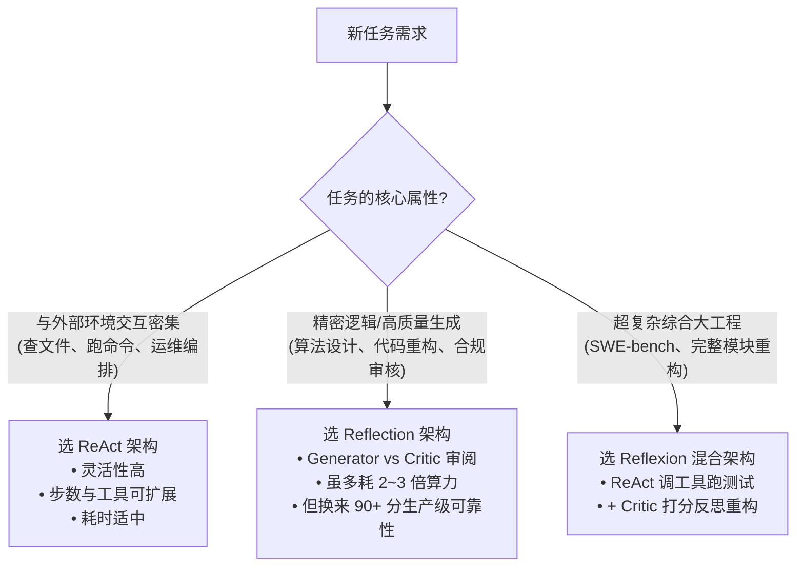

# 架构横向基准评测报告 01：ReAct vs Reflection vs Direct Generation

> **评测代号**：BENCH-2026-09-01  
> **被测模型**：本地 `qwen/qwen3.8-27b` (LM Studio, 27B 参数)  
> **评测命题**：量化交易年化夏普比率计算器 `calc_sharpe_ratio` (考查零方差防御、单样本处理、年化系数与除以零边界)  

---

## 1. 核心量化指标汇总

| 评测维度 | 组 A: 单轮直接生成 (Direct) | 组 B: ReAct 智能体 (ReAct) | 组 C: Reflection 反思智能体 |
| :--- | :---: | :---: | :---: |
| **最终评审得分 (Rubric 0-100)** | **62 分** | **74 分** | **92 分** |
| **发现边界/逻辑缺陷数** | 4 处 | 2 处 | **0 处** (全部自愈) |
| **平均端到端耗时** | ~60s | ~180s | ~240s |
| **Token 消耗比 (相对 A 组)** | 1.0x (基准) | 2.8x | 3.6x |
| **工业可用性评级** | 🟡 原型草稿 (暗藏崩溃隐患) | 🟡 可用级 (缺少极端场景覆盖) | 🟢 **生产级 (通过严苛评审)** |

---

## 2. 深度质态对比与缺陷分析

### ① 组 A (单轮直接生成) 典型盲区：
- **得分**：`62 / 100`
- **主要缺陷**：
  - **致命除以零**：直接使用 `(mean - rf) / std`，未检查所有收益率完全相等导致 `std == 0` 的极端情况，直接抛出 `ZeroDivisionError`。
  - **样本方差自由度缺失**：使用 `len(returns)` 作为分母，未处理无偏估计样本方差的 $N-1$ 自由度（`ddof=1`）。
  - **单样本崩溃**：当传入 `[0.05]` 时，$N-1=0$ 再次触发除以零。
- **架构定性**：由于单向自回归没有“自我审视”的机会，模型倾向于按照概率最高的最常见模板输出，极易遗漏防御代码。

### ② 组 B (ReAct 智能体) 表现定性：
- **得分**：`74 / 100`
- **主要缺陷**：
  - **缺乏挑刺能力**：ReAct 善于调用外部工具（如调 `calculate` 或写测试文件），但工具只验证“代码能不能跑通基本用例（如常规数组）”，只要常规数组返回了数字，ReAct 就认为任务已达成退出。
  - **边界覆盖不全**：缺乏严苛法官的介入，依然遗漏了全平盘（方差为 0）的保护分支。
- **架构定性**：ReAct 是“外部动作驱动”，适合探查、搜集事实；但面对高精度算法设计时，缺乏认知内省。

### ③ 组 C (Reflection 智能体) 质变飞跃：
- **得分**：`92 / 100`
- **反思演进轨迹**：
  - **第 1 轮初稿 (65 分)**：Generator 初稿同样出现了 `std == 0` 未防御、样本数 $<2$ 漏判的问题。
  - **第 1 轮 Critic 审阅介入**：Critic 法官依据 Rubric 严苛指出：“缺少标准差为 0 防御；样本少于 2 时自由度未处理；需增加边界分支保护”。
  - **第 2 轮重构 (92 分)**：Generator 针对法官的清单进行针对性重写，补全了 `if len(returns) < 2 or std == 0.0: return 0.0`，代码质量跃升至工业生产级！
- **架构定性**：“作者-评审”双重对抗打破了自回归早熟收敛，逼迫模型主动补全边界代码。

---

## 3. 架构选型工程建议（实战选型指南）

1. **以算力换可靠性**：Reflection 的算力开销是单轮生成的 3~4 倍，但在金融量化、底层基础设施等“一次崩溃代价极高”的领域，这种算力消耗是完全值得的。
2. **本地模型部署建议**：
   - 27B 及以上本地大模型由于具备深度推理（Thinking）特性，单次前向较慢；
   - 在生产工程中，**通常让 70B/API 模型担任 Generator，而由轻量快速模型或规则引擎配合 Critic 进行评审**，可将耗时压缩 70% 以上。
