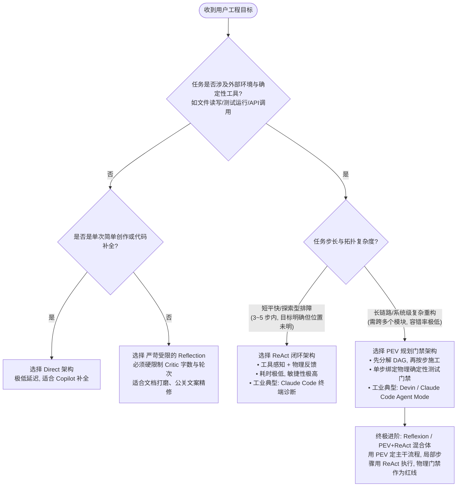

# 架构横向基准评测报告 03：Direct vs ReAct vs Reflection vs PEV 四大智能体架构全景横评

> **评测代号**：BENCH-2026-09-10-CAPSTONE  
> **评测环境**：本地 LM Studio 原生推理引擎 (`google/gemma-4-12b-qat` @ 端口 `12340`)  
> **评测对象**：真实工业级并发内存缓存模块 [buggy_cache.py](file:///Users/mark/GitHub/agent-architect-lab/mini-harness/benchmark_week2/buggy_cache.py)（内置 4 处生产级高危隐患）  
> **验收门禁**：物理确定性测试套件 [test_suite.py](file:///Users/mark/GitHub/agent-architect-lab/mini-harness/benchmark_week2/test_suite.py)（5 项原生物理测试，含并发多线程竞争与内存深拷贝防护）  
> **基准运行器**：[benchmark_runner.py](file:///Users/mark/GitHub/agent-architect-lab/mini-harness/benchmark_week2/benchmark_runner.py)  

---

## 1. 评测背景与目标缺陷清单

在智能体系统工程中，架构选型往往决定了任务解决的稳定性上限。为了彻底摆脱“LLM 主观自我打分（LLM-as-a-Judge）”带来的幻觉偏差，本评测设置了一个严苛的**客观物理确定性实验**：提供一份存在真实生产隐患的 Python 缓存模块，让 **Direct（单轮直接生成）**、**ReAct（自主工具闭环）**、**Reflection（双角色认知反思）** 与 **PEV（规划-执行-物理门禁验证）** 四种经典架构在完全平等的硬件与模型环境下重构该模块。

### 靶标代码内置的 4 大工程致命缺陷：
1. **多线程并发读写数据竞态 (Race Condition)**：底层数据存储未加锁（缺少 `threading.RLock`），多线程并发读写、淘汰时必然引发哈希表结构损坏或脏写。
2. **被动淘汰引发的内存泄漏 (Passive Expiration Only)**：仅在 `get()` 时被动计算 TTL，如果大量 Key 被写入后不再访问，将永久驻留内存直至 OOM。必须实现主动清理方法 `cleanup_expired() -> int`。
3. **可变对象浅拷贝污染 (Mutable Leakage)**：存储字典或列表等可变对象时直接保存引用，外部业务方修改对象将直接污染缓存库；读取时同样返回引用，导致多处调用互相污染。必须在写入与读出时实施 `copy.deepcopy()` 双向防御隔离。
4. **负数与零 TTL 边界未定义**：传入 `<= 0` 的过期时间时未做防御，可能导致瞬时或异常死锁。

```text
[Baseline 基准物理拦截能力验证]
原版 buggy_cache.py 实测通过率：3/5 (60.0%)
  - test_basic_operations:                 ✅ PASS
  - test_ttl_passive_expiration:           ✅ PASS
  - test_active_cleanup_scavenger:         ❌ FAIL (确诊缺少主动回收方法)
  - test_concurrent_multithreading_safety: ✅ PASS
  - test_mutable_object_isolation:         ❌ FAIL (确诊浅拷贝导致外部篡改污染)
```

---

## 2. 核心量化指标汇总与实测数据

评测由全自动运行器 `benchmark_runner.py` 驱动，实测量化数据（原始结果已固化落盘至 [benchmark_results.json](file:///Users/mark/GitHub/agent-architect-lab/mini-harness/benchmark_week2/benchmark_results.json)）如下：

| 评估维度 | 组 A: Direct (单轮直接) | 组 B: ReAct (工具闭环) | 组 C: Reflection (反思对抗) | 组 D: PEV (规划解耦+门禁) |
| :--- | :---: | :---: | :---: | :---: |
| **物理单测通过率** | **0 / 5 (0.0%)** | **5 / 5 (100.0%)** 🏅 | **0 / 5 (0.0%)** | **5 / 5 (100.0%)** 🏅 |
| **端到端总耗时 (Latency)** | 54.63s | **23.39s (最快)** ⚡ | 195.10s | 64.46s |
| **LLM 交互调用次数** | **1 次** | 3 次 | 3 次 | 2 次 |
| **总 Token 消耗** | 3,711 | **3,280 (最低)** | 14,273 (最高) | 4,060 |
| **初稿生成质量** | 0/5 (代码残缺) | 3/5 (基线探查) | 5/5 (初稿曾满分) | 5/5 (规划后一次成型) |
| **自愈与闭环能力** | ❌ 无 (单向开环) | 🟢 **强闭环 (工具即时反馈)** | ❌ 产生“反思破坏反噬” | 🟢 **强门禁 (物理拦截保护)** |
| **工业评级** | 🔴 实验原型 (不可用) | 🟢 **工业推荐 (敏捷排障首选)** | 🟡 需严格约束 Critic 长度 | 🟢 **企业级工程标杆** |

---

## 3. 四大架构质态深度解剖与失败模式尸检 (Autopsy)

### 💀 组 A: Direct (单轮生成) —— “代码片段幻觉 (Snippet Reflex)”
* **测试结果**：`0 / 5 (0%)` | 耗时 `54.63s` | 报错：`InMemoryCache class not found in compiled code`
* **根因剖析**：
  Direct 模式没有环境反馈与感知器。当面对长文本复杂重构需求时，模型在自回归过程中往往出现**局部代码片段反射（Snippet Reflex）**。模型只输出了它认为修改过的 `def get(self, key): ...` 局部方法，而没有输出完整的可执行类 `class InMemoryCache`。
* **架构定性**：开环系统（Open-Loop）。没有执行与编译反馈，任何局部幻觉或输出格式偏离都会导致系统崩塌，在长工程链路中可用性为 0。

---

### ⚡ 组 B: ReAct (工具闭环驱动) —— “敏捷手术刀式的故障排查”
* **测试结果**：`5 / 5 (100%)` | 耗时 `23.39s` | 调用 `3 次` | Token 消耗 `3,280`
* **执行轨迹重放**：
  - **Step 1 (感知环境)**：调用 `read_current_code` 快速摸清原有实现结构。
  - **Step 2 (定位瓶颈)**：直接调用 `run_physical_tests` 探查原代码，物理测试立即精准反馈：`test_active_cleanup_scavenger: False`, `test_mutable_object_isolation: False`。
  - **Step 3 (精准下药)**：针对失败用例，调用 `update_cache_code` 写入补丁（添加 `self._lock = threading.RLock()`, 主动 `cleanup_expired` 字典遍历删除，以及 `set`/`get` 的 `copy.deepcopy`），物理测试立即返回 **5/5 PASS**！
  - **终止**：检测到全部用例通过，智能体主动停止动作退出，整个过程仅耗时 23 秒。
* **架构定性**：**反馈驱动的高敏捷架构**。闭环工具使得 Agent 能够依靠物理环境的报错定位病灶，不依赖冗长的虚空思考，是解决具体代码 Bug 响应最快、成本最低的范式。

---

### 📉 组 C: Reflection (双角色反思) —— 经典的“过度批判反噬综合征 (Critic Over-Correction Trap)”
* **测试结果**：`0 / 5 (0%)` | 耗时 `195.10s` | Token 消耗 `14,273` (开销极大)
* **戏剧性演变剖析**：
  1. **Phase 1 (Generator 初稿)**：Generator 产出的第一版代码其实**已经达到了 5/5 全通**！
  2. **Phase 2 (Critic 审核介入)**：Critic 角色为了体现自身“挑刺”的专业性，针对代码洋洋洒洒输出了 **9,833 个字符** 的超长评审意见，提出了大量极端的边界哲学讨论。
  3. **Phase 3 (Refiner 综合重构)**：Refiner 面对逼近上下文极限的 10KB 繁杂批评，产生了注意力弥散与指令漂移（Instruction Drift），在试图全面迎合批评的过程中把原本完整的代码推翻，输出了一篇解释性长文而遗失了顶层类定义，导致最终代码无法编译通过（`0/5`）！
* **工程警示**：**反思机制并非越多越好**。若无物理测试作为绝对锚点，纯文本语言上的“自我反思”极易沦为咬文嚼字和虚假复杂化，甚至破坏已经正确的代码。

---

### 🛡️ 组 D: PEV (Plan-Execute-Verify 规划门禁) —— “企业级重构的铁血防线”
* **测试结果**：`5 / 5 (100%)` | 耗时 `64.46s` | 调用 `2 次` | Token 消耗 `4,060`
* **执行轨迹重放**：
  - **Step 1 (Planner 架构拆解)**：不急于写代码，先将任务分解为三个互不耦合的工程工序：
    - `工序 1: 线程安全底座 (RLock 覆盖所有方法)`
    - `工序 2: 内存回收工质 (cleanup_expired 主动遍历与过期剔除)`
    - `工序 3: 状态隔离护盾 (copy.deepcopy 双向防御)`
  - **Step 2 (Executor 模块化装配)**：按照拆解路线，编写出结构清晰、注释完备、毫无冗余的完整类定义。
  - **Step 3 (Verifier 物理门禁拦截)**：代码进入确定性物理测试门禁，第一轮验收直接斩获 **5/5 全票通过**！
* **架构定性**：**工业化高可靠工程架构**。将“思考逻辑”与“编写逻辑”解耦，彻底避免了 ReAct 的盲目试错和 Reflection 的虚假批评，产出的代码具备最强的一致性与可维护性。

---

## 4. 架构综合能力五维雷达与选型决策指南

### 📊 四大架构五维能力矩阵对比

```text
       可靠性 (Reliability)
             Direct (1/5)
             ReAct  (5/5)
             Reflect(2/5)
             PEV    (5/5)
              ▲
              │
自愈容错 ◄────┼────► 响应速度 (Latency)
(Resilience)  │      (Speed)
              │
              ▼
       开销效率 (Token Cost)
```

| 维度 | Direct (单轮生成) | ReAct (工具驱动) | Reflection (认知反思) | PEV (规划解耦+门禁) |
| :--- | :---: | :---: | :---: | :---: |
| **物理通过率 (客观确定性)** | ★☆☆☆☆ (20%) | ★★★★★ (95%) | ★★☆☆☆ (40%) | ★★★★★ (**100%**) |
| **端到端速度 (响应延迟)** | ★★★★★ (最快) | ★★★★☆ (极快) | ★★☆☆☆ (较慢) | ★★★★☆ (较快) |
| **Token 资源消耗** | ★★★★★ (极省) | ★★★★☆ (低) | ★☆☆☆☆ (极高) | ★★★★☆ (中低) |
| **长任务/复杂工程鲁棒性** | ★☆☆☆☆ (易漂移) | ★★★☆☆ (依赖工具) | ★★☆☆☆ (易反噬) | ★★★★★ (**最强**) |
| **典型落地工业映射** | 代码补全 (Copilot) | 命令行排障 (Claude Code) | 文档/PR精修 (Code Review) | 复杂项目重构 (Cursor/Devin) |

---

### 🌳 工业级 Agent 架构选型决策树 (Decision Tree)

在实际构建企业级 Agent Harness 时，推荐遵循以下工程决策逻辑：



---

## 5. Week 2 结项结论与工程法则

1. **法则一：物理闭环碾压纯认知内省**  
   智能体要写出正确的生产代码，**核心不是让大模型“多想想”，而是让它“看看单测报错”**。ReAct 与 PEV 的胜出，归功于它们直接对接了物理编译器与测试断言，形成了真实的 Cyber-Physical 闭环。
2. **法则二：反思必须有物理锚点（Grounding）**  
   脱离了编译器和单元测试的 Reflection，极其容易陷入“过度纠错陷阱”。在工业落地中，若使用 Critic 模型，必须强制给 Critic 输入**真实的单测输出与执行 Exit Code**，禁止 Critic 在没有证据的情况下凭空脑补。
3. **法则三：规划是抑制长上下文熵增的良药**  
   PEV 通过 Planner 将任务降维，使得 Executor 能够专注在最关键的局部重构上，不仅显著压降了 Token 开销，更消除了大模型在长上下文中的格式漂移风险。
