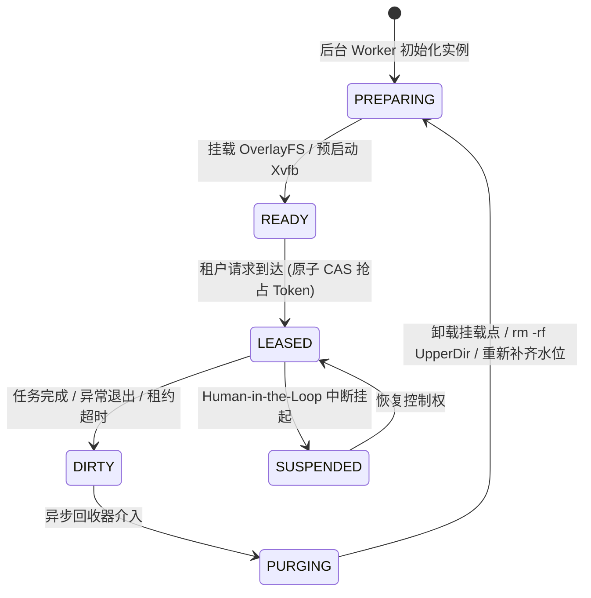

# 专题 01：沙箱运行时生命周期（一）—— OverlayFS 预热池、COW 毫秒级重置与资源配额加固

> **所属阶段**：Agent 后端架构专项 · Week 1  
> **核心攻坚**：Linux 文件系统联合挂载、沙箱预热池状态机、毫秒级冷启动消除、Fork 炸弹防御

---

## 1. 核心工业痛点：为什么普通 Docker 在 Computer Use 场景下会崩溃？

在 Computer Use 和自主代码 Agent 场景下，沙箱的使用模式具有极高频、极短突发、强环境污染的特性：
1. **冷启动延迟高**：拉起一个装有完整桌面环境（Xvfb + Fluxbox + Chrome + 中文字体，镜像体积 2~4GB）的容器，`docker run` 耗时通常在 **3~6 秒**，用户点击触发后等待过久。
2. **环境状态污染**：Agent 执行 `rm -rf`、安装脏包或创建临时文件后，若不销毁容器，下一个租户会读取到残留数据；若每次彻底销毁重建，容器销毁与镜像解压的磁盘 IO 开销会导致宿主机 CPU/IO 飙升。
3. **恶意进程与资源死锁**：Agent 误执行死循环或 Fork 炸弹时，如果未配置精细的 Cgroups v2 `pids.max`，会导致宿主机 PID 资源耗尽从而全盘死锁。

---

## 2. 核心架构设计：OverlayFS 联合文件系统的工作原理

Linux OverlayFS 是一种 Union 联合挂载文件系统，将多个目录组合为一个单一的统一视图：

```
             ┌──────────────────────────────────────────────┐
             │       Merged Dir (用户与容器看到的最终视图)      │
             └──────────────────────┬───────────────────────┘
                                    │ (Union Mount)
          ┌─────────────────────────┴─────────────────────────┐
          │                                                   │
┌─────────────────────────┐                         ┌───────────────────┐
│ UpperDir (可写变更层)    │                         │ WorkDir (内部临时) │
│ - 临时分配在 /tmp/pool/   │                         │ - 必须与 Upper 在 │
│ - 仅保存当前会话增删改文件 │                         │   同一个文件系统  │
└─────────┬───────────────┘                         └───────────────────┘
          │ (Copy-on-Write 写时复制)
┌─────────┴─────────────────────────────────────────────────────────────┐
│ LowerDir (只读基础 Gold Image)                                         │
│ - 不可变层 (预装 OS、X11、浏览器环境，只读共享给成百上千个沙箱实例)        │
└───────────────────────────────────────────────────────────────────────┘
```

### 关键文件操作行为剖析：
1. **读操作（Read）**：
   - 如果文件在 `UpperDir` 存在，直接读 `UpperDir`；
   - 否则穿透读取 `LowerDir`。所有沙箱实例并发读取同一个只读基础层，零内存/磁盘冗余。
2. **写/改操作（Write/Modify）**：
   - 触发 **COW（Copy-on-Write）**：当 Agent 第一次尝试修改 `LowerDir` 中的文件时，Linux 内核自动将该文件从 `LowerDir` 拷贝一份到 `UpperDir`，随后的写操作全部发生在 `UpperDir` 中。`LowerDir` 保持绝对纯净。
3. **删操作（Delete）与 Whiteout 特殊文件**：
   - 当 Agent 在沙箱内删除一个 `LowerDir` 里的预置文件时，Linux 不会也不能修改 `LowerDir`，而是在 `UpperDir` 中创建一个主次设备号为 `0/0` 的字符设备文件（Character Device, `mknod c 0 0`），称为 **Whiteout 文件**。
   - Merged 视图看到 Whiteout 文件时，自动对上层应用隐藏该文件，模拟文件已被删除的效果。

---

## 3. 预热池（Standby Pool）状态机设计

为了实现 `< 50ms` 的极速分配，系统必须引入双缓冲预热池模型：



### 核心机制设计：
1. **水位线维持（Watermark Scaling）**：
   - 设定 `min_idle = 3`，`max_capacity = 10`。
   - 后台 Daemon 协程每 100ms 巡检就绪实例数，若小于 `min_idle` 则立即异步初始化新实例补充池子。
2. **租约超期强制收割（Lease Reaper）**：
   - 每个被借出的沙箱拥有独立 `lease_ttl`（默认 5 分钟）与 `last_heartbeat`。
   - 若 Agent 进程死锁或网络异常断开，超过 TTL 触发强杀并转入 `DIRTY` 状态。
3. **变更审计（Action Diffing）**：
   - 任务结束时，遍历 `UpperDir` 即可毫秒级获取 Agent 在执行过程中生成的所有新建、修改和删除的文件清单，作为 Trace 审计物料。

---

## 4. 内核安全红线：Cgroups v2 与资源配额

生产级部署时，必须通过 Cgroups v2 注入以下硬隔离约束：

```bash
# 限制单个沙箱最大进程数，彻底免疫 Fork 炸弹
echo "512" > /sys/fs/cgroup/sandbox_101/pids.max

# 限制单沙箱内存上限为 2GB，一旦超额直接将整个进程树全灭，绝不留僵尸
echo "2147483648" > /sys/fs/cgroup/sandbox_101/memory.max
echo "1" > /sys/fs/cgroup/sandbox_101/memory.oom.group

# 限制 CPU 配额 (2 个完整 CPU 核心)
echo "200000 100000" > /sys/fs/cgroup/sandbox_101/cpu.max
```

---

## 5. 面试深水区要点总结

1. **Q: 为什么 workdir 必须和 upperdir 在同一个底层文件系统上？**  
   *答*：OverlayFS 在写入大文件或修改目录元数据时，需要利用 `workdir` 进行原子的重命名（`rename(2)`）操作来保证事务一致性。而跨文件系统/分区的 `rename(2)` 会报 `EXDEV`（Invalid cross-device link）错误。
2. **Q: 如何做到秒级复位？**  
   *答*：传统容器重置需要重新创建并拉起；OverlayFS 预热池方案只需要 `umount`，然后对 `upperdir` 执行轻量的 `rm -rf`（或在后台异步并发删除），直接重新挂载一个新的空 `upperdir` 即可，耗时控制在 10~20ms 以内。
