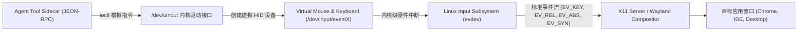

# 专题 02：沙箱运行时生命周期（二）—— X11 MIT-SHM 零拷贝截屏与 `/dev/uinput` 底层事件注入

> **所属阶段**：Agent 后端架构专项 · Week 1  
> **核心攻坚**：X11 MIT-SHM 共享内存映射、高保真截屏延迟压降（< 8ms）、Linux 内核 `/dev/uinput` 虚拟输入驱动、高分屏（DPI）坐标变换矩阵与贝塞尔平滑轨迹

---

## 1. 核心工业痛点：Computer Use 的感知与执行瓶颈

在桌面自动化（Computer Use）执行循环中，Agent 每一次行动都遵循：
$$\text{Screenshot (感知)} \longrightarrow \text{VLM Inference (决策)} \longrightarrow \text{Mouse/Keyboard Action (执行)} \longrightarrow \text{Verification (验证)}$$

生产环境中，**感知（截屏）与执行（输入注入）往往成为拖垮系统延迟与稳定性的元凶**：

1. **传统截屏的巨大开销（80ms ~ 150ms）**：
   - 传统方案（如 Python `Pillow.ImageGrab` 或原生 X11 `XGetImage`）通过 X11 Protocol 协议套接字传输画面。
   - 一张 1080P（1920x1080 32-bit RGBA）原始图像体积约为 **8.29 MB**。每一次截屏都需要经历：`X Server FrameBuffer` $\to$ `内核 Socket 缓冲区` $\to$ `用户态客户端内存` $\to$ `磁盘/临时图片编码`。这一过程单次耗时达 **80~150ms**，在 30 步长程任务中仅截屏就浪费数秒甚至导致画面撕裂。
2. **传统输入模拟的脆弱性（`pyautogui` 之殇）**：
   - 依赖应用层事件注入（如 `pyautogui` / `xdotool` 简单封装），极易丢失修饰键（如 `Ctrl+Shift+Down` 长按失灵）；
   - 在多显示器、Retina 屏或 Windows 125%/150% DPI 缩放下，模型给出的绝对坐标发生严重偏移，导致“点不准”；
   - 鼠标瞬间传送（Teleportation）缺乏轨迹，容易被反自动化（Anti-Bot）系统识别拦截。

---

## 2. 核心架构设计：X11 MIT-SHM 零拷贝高速截屏

### 2.1 传统 Socket 传输 vs MIT-SHM 共享内存对照

```text
【传统 X11 GetImage 流程 (80~150ms)】
┌──────────────┐   Unix Domain Socket (8.3MB 拷贝)   ┌──────────────────┐
│   X Server   │ ──────────────────────────────────> │  Agent Sidecar   │
│ FrameBuffer  │    (内核态 <-> 用户态 多次上下文切换)  │  (用户进程内存)   │
└──────────────┘                                     └──────────────────┘

【X11 MIT-SHM 零拷贝流程 (< 8ms)】
┌──────────────┐                                     ┌──────────────────┐
│   X Server   │                                     │  Agent Sidecar   │
└──────┬───────┘                                     └────────┬─────────┘
       │                                                      │
       │ XShmGetImage (发送极小 RPC 指令)                      │ mmap 零拷贝读取
       ▼                                                      ▼
 ┌──────────────────────────────────────────────────────────────────────┐
 │             POSIX Shared Memory Segment (共享内存物理页)               │
 │           /dev/shm 或 shmget/shmat 映射区 (1920x1080x4 Bytes)          │
 └──────────────────────────────────────────────────────────────────────┘
```

### 2.2 MIT-SHM 核心底层系统调用与生命周期
1. **创建共享内存**：
   通过 `shmget(IPC_PRIVATE, size, IPC_CREAT | 0777)` 或 POSIX `shm_open()` 分配与屏幕分辨率匹配的共享内存段；
2. **挂载共享段**：
   客户端调用 `shmat(shmid, NULL, 0)` 将该物理页映射到本进程虚拟地址空间；
3. **通知 X Server 关联**：
   调用 `XShmAttach(display, &shminfo)`，将该共享段挂载到 X Server 的地址空间；
4. **极速取帧（零拷贝）**：
   调用 `XShmGetImage(display, window, image, 0, 0, AllPlanes)`。X Server 直接将显存/虚拟 FrameBuffer DMA 拷贝至共享内存，客户端无需经由 Socket 传输即可直接用指针读取原始像素矩阵，**耗时骤降至 3~8ms**。

---

## 3. 核心架构设计：Linux 内核级 `/dev/uinput` 事件注入

为了实现工业级高保真的硬件级交互，最佳实践是绕过 X11 的应用层钩子，直接使用 Linux 内核输入子系统：**/dev/uinput**。



### 3.1 Linux 输入事件协议契约（Input Event Contract）
每个输入事件封装为一个 `struct input_event`（24 字节）：
- `type`: 事件类型（`EV_KEY` 按键, `EV_REL` 相对位移, `EV_ABS` 绝对坐标, `EV_SYN` 同步事件）；
- `code`: 按键键码（`KEY_A`, `BTN_LEFT`, `BTN_RIGHT`）；
- `value`: 事件值（`0` 释放, `1` 按下, `2` 重复长按）；
- **同步帧标志 `EV_SYN`**：每个鼠标动作或按键操作后必须注入一个 `SYN_REPORT` 事件，通知内核刷入原子状态包。

### 3.2 修饰键原子操作与组合键（Modifier Keys Protocol）
当 Agent 需要触发 `Ctrl + Shift + T`（恢复关闭的标签页）时，严禁使用非原子的字符串输入：
```text
Step 1: EV_KEY, KEY_LEFTCTRL, 1   -> EV_SYN
Step 2: EV_KEY, KEY_LEFTSHIFT, 1  -> EV_SYN
Step 3: EV_KEY, KEY_T, 1          -> EV_SYN
Step 4: EV_KEY, KEY_T, 0          -> EV_SYN
Step 5: EV_KEY, KEY_LEFTSHIFT, 0  -> EV_SYN
Step 6: EV_KEY, KEY_LEFTCTRL, 0   -> EV_SYN
```

---

## 4. 高分屏（DPI）坐标换算与平滑贝塞尔轨迹生成

### 4.1 坐标归一化与缩放矩阵数学模型
模型通常输出归一化坐标 $P_{norm} = (x_{norm}, y_{norm}) \in [0, 1] \times [0, 1]$，或者基于标准千分比 $P_{1000} \in [0, 1000] \times [0, 1000]$。

在物理屏幕分辨率为 $(W, H)$、系统缩放比例（DPI Scale Factor）为 $S$（例如 Windows 150% 缩放下 $S = 1.5$）时：

$$\begin{bmatrix} X_{phys} \\ Y_{phys} \end{bmatrix} = \begin{bmatrix} \text{round}(x_{norm} \times W \times S) \\ \text{round}(y_{norm} \times H \times S) \end{bmatrix}$$

系统必须在 Sidecar 层自动获取当前屏幕的物理分辨率与缩放系数，完成透明的矩阵映射，向 Agent 模型屏蔽 OS 显示器缩放细节。

### 4.2 三次贝塞尔曲线平滑鼠标轨迹（Anti-Bot & Natural Movement）
为了防止鼠标瞬间闪现（Teleportation）触发反爬虫或游戏防外挂机制，并保证 WebRTC 录屏轨迹的真实可读性，系统在起始点 $P_0$ 和目标点 $P_3$ 之间生成 **三次贝塞尔曲线（Cubic Bézier Curve）**：

$$B(t) = (1-t)^3 P_0 + 3(1-t)^2 t P_1 + 3(1-t) t^2 P_2 + t^3 P_3, \quad t \in [0, 1]$$

- $P_1, P_2$ 为根据两点距离动态加权扰动的随机控制点（Control Points）；
- $t$ 采用缓入缓出（Ease-in-out）时间步长分布，精确模拟人类手腕移动鼠标时先加速后减速的生理惯性特征。

---

## 5. 面试深水区问答指南

1. **Q: 为什么 MIT-SHM 截屏能将延迟从 100ms 压到 5ms？**  
   *答*：传统 X11 `GetImage` 是“拉取式网络协议”，数据必须先完整拷贝到 X11 Socket 缓冲区，引发用户态/内核态多次上下文切换和巨大内存分配。MIT-SHM 利用共享内存，两端直接映射同一块物理内存页，X Server DMA 写入后客户端直接读取指针，零 Socket 拷贝开销。
2. **Q: 为什么 `/dev/uinput` 比应用级模拟更稳定？**  
   *答*：应用级模拟（如在某个窗口句柄上发送 Win32 `WM_CLICK` 或 X11 `XSendEvent`）往往带有 `synthetic` 假事件标志，极易被 Chrome 沙箱或安全控件静默丢弃。而 `/dev/uinput` 直接在内核注册为合法的虚拟硬件设备（如同插了一个真实的 USB 键盘鼠标），操作系统和应用完全无法区分。
