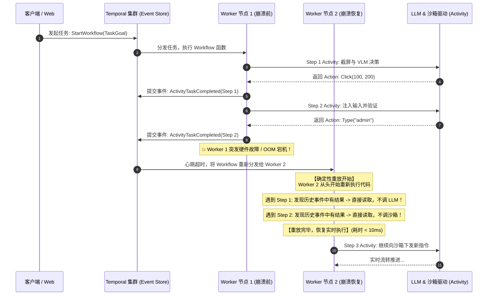

# 专题 03：分布式状态机——基于 Temporal.io 的长程任务重放与 Human-in-the-Loop 中断

> **所属阶段**：Agent 后端架构专项 · Week 2 核心攻坚  
> **核心难题**：长耗时 Agent 崩溃自愈、确定性重放（Deterministic Replay）、事件溯源（Event Sourcing）、异步信号人机接管（Human-in-the-Loop）与 Saga 补偿事务

---

## 1. 核心工业痛点：为什么传统消息队列（Celery/BullMQ）做不了长程 Agent？

在 Computer Use 场景下，一个真实的端到端业务任务（如“登录系统，下载月度报表，提取字段填入 CRM 并发送确认邮件”）通常需要 **30 ~ 80 个步骤**，整体运行时间持续 **5 ~ 30 分钟**。

如果后端采用传统消息队列（如 Celery、BullMQ、RabbitMQ）：

```text
【传统 Celery 架构的致命缺陷】
Step 1 -> Step 2 -> ... -> Step 25 (突然 Worker 内存溢出 OOM 或网络闪断 重启!)
                            │
                            ▼
              💥 整个 Python 进程内存状态彻底化为乌有！
              - 前序 25 步消耗的数十万 Tokens ($2.5) 全部打水漂；
              - 沙箱处于半脏不净的中间态；
              - 外部系统（如已经发出去的一半邮件）无法回滚；
              - 只能从 Step 1 从头重跑，极易造成数据二次重复污染！
```

更为棘手的是 **人在回路（Human-in-the-Loop, HITL）**：
* 当遇到“双重身份验证（2FA）短信验证码”或“高危付款审批”时，Agent 必须**挂起长达数分钟甚至数小时**等待人类输入。
* 传统 Worker 同步阻塞等待会耗尽连接池和线程，异步轮询数据库则会导致状态机极其脆弱且难以维护。

---

## 2. 核心架构设计：Temporal 核心哲学与确定性重放（Deterministic Replay）

工业级 Agent 后端调度系统（如 Temporal.io / Cadence）采用 **事件溯源（Event Sourcing）** 与 **确定性执行（Deterministic Execution）**，将代码本身直接作为状态机。



### 确定性重放的关键契约：
1. **Workflow 代码必须具有确定性（Deterministic）**：
   - Workflow 函数内部**严禁调用随机数 `random()`、系统时钟 `time.time()` 或直接发起网络请求**；
   - 所有的外部副作用（调大模型、调沙箱点击、查数据库）**必须封装在 Activity 中**。
2. **零成本瞬时恢复**：
   - 当任务在第 25 步崩溃时，新节点拉起后，前 24 步由于直接从 Event History 中获取结果，耗费 **0 个 Token、0 次真实点击，在 10 毫秒内重构内存状态**，直接无缝执行第 25 步！

---

## 3. 人在回路（HITL）信号架构：异步通道与权限抢占

在 Temporal 中，人机协同是通过 **Signal（异步信号输入）** 与 **Query（状态同步查询）** 实现的，绝非轮询数据库。

```mermaid
flowchart TD
    A[Agent 自动执行中] --> B{Step 决策是否触碰红线?}
    B -->|高危操作: 转账/删库/验证码| C[向 Web 客户端发送 ApprovalNeeded 消息]
    C --> D[Workflow 挂起阻塞在 SignalChannel 上<br/>(零 CPU 消耗, 支持等待数天)]
    
    subgraph HumanInteraction["人类外部接入 (Web / 移动端)"]
        E[用户在前端查看当前截图与告警]
        E -->|点击批准 / 输入验证码| F[向 Temporal 发送 Signal: ApproveSignal / TakeoverSignal]
    end
    
    F --> D
    D --> G{人工信号判断}
    G -->|Approve 信号| H[恢复自动执行]
    G -->|Reject 信号| I[触发 Saga 补偿事务，安全回滚]
    G -->|Takeover 接管| J[交由用户通过 WebRTC 远程桌面手动操作]
```

### 核心代码模式（Go / Python 状态机通用逻辑）：
```python
# 伪代码：Temporal 原生信号监听范式
approval_channel = workflow.get_signal_channel("HumanApprovalSignal")

if step.is_dangerous:
    # 挂起 Workflow，等待外部人类信号，可设置超期兜底 TTL (如 24 小时)
    approved = workflow.await_with_timeout(timedelta(hours=24), approval_channel.has_data)
    if not approved or approval_channel.receive() == "REJECT":
        # 触发 Saga 补偿回滚
        yield workflow.execute_activity(rollback_compensating_action, step)
        return TaskAborted()
```

---

## 4. 故障回滚与 Saga 补偿事务（Compensating Transactions）

在自动化执行过程中，如果某个步骤在沙箱中造成了非预期错误（如点错了非预期链接），系统必须具备**逆向补偿机制**：

```text
正向执行链:  Step 1 (创建临时目录) -> Step 2 (写入测试数据) -> Step 3 (不可逆破坏异常!)
                                                                  │
                                                                  ▼
逆向补偿链:  Rollback Step 2 (删除测试数据) <- Rollback Step 1 (清理临时目录)
```

结合我们在专题 01 中实现的 **OverlayFS UpperDir 差量回滚与 Checkpoint 快照**，Agent 状态机可以在检测到连续异常时，自动调度 `RollbackActivity`，将沙箱直接复位到上一个健康的检查点，并在下一次决策中注入反思日志（Self-Reflective Critique）。

---

## 5. 面试深水区要点总结

1. **Q: 为什么 Agent 状态机不能直接存 MySQL/Redis？**  
   *答*：传统 CRUD 数据库记录的是“最终状态（State Mutation）”，丢失了完整的中间因果链条（Causal Chain）。而事件溯源（Event Sourcing）记录的是不可变的“事实事件流（Stream of Events）”。只有基于事件流，才能实现**任意步骤的确定性时间穿越（Time-Travel Debugging）**、**故障无感重放（Replay）** 以及 **审查每一帧视觉决策轨迹的合规审计**。
2. **Q: Temporal 的 Workflow 函数如果包含非确定性代码会发生什么？**  
   *答*：会触发致命的 `NonDeterministicWorkflowError`。因为重放时，Temporal 会比对代码执行路径与历史记录中的 Event ID；如果因为 `time.time()` 或随机数导致代码走向了不同的 `if-else` 分支，重放就会失准崩溃。因此所有非确定性逻辑必须严格封装在 Activity 中。
