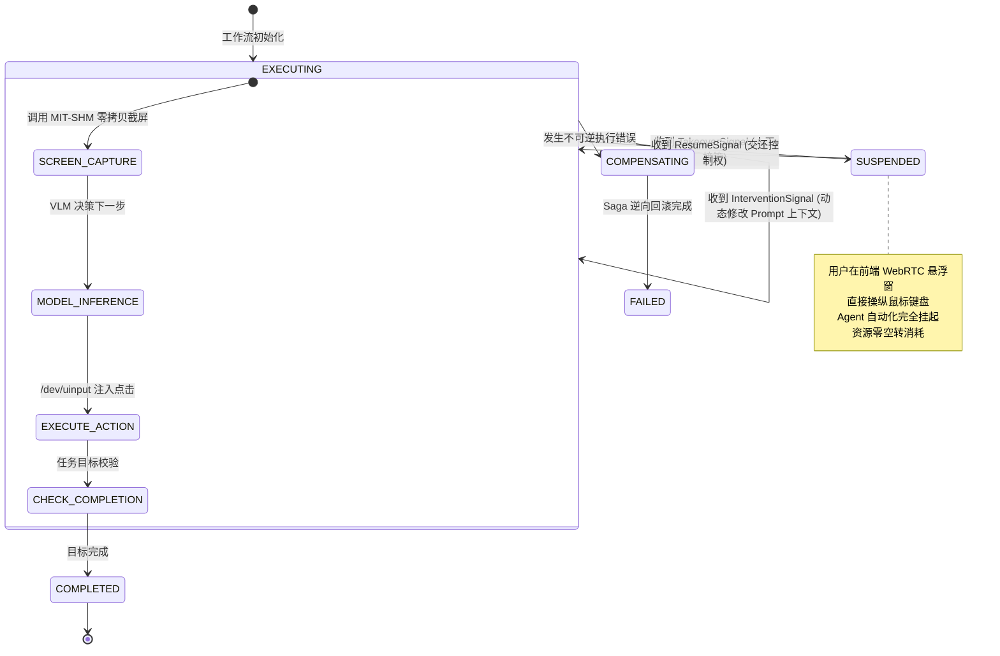

# 专题 03：分布式状态机 —— 基于 Temporal.io 的长程任务确定性重放与 Human-in-the-Loop 抢占

> **所属阶段**：Agent 后端架构专项 · Week 2  
> **核心攻坚**：事件溯源（Event Sourcing）、确定性重放（Deterministic Replay）、Workflow vs Activity 边界、无损状态持久化、Human-in-the-Loop (HITL) 抢占信号与 Saga 逆向补偿机制

---

## 1. 核心工业痛点：为什么传统任务队列在长程 Agent 场景下必死无疑？

在桌面自动化（Computer Use）或长链代码重构等复杂场景中，一个任务通常由 **30 ~ 80 个串行步骤** 组成，持续时间长达 **5 ~ 30 分钟**，甚至在等待用户人工确认时会拉长到数小时。

如果采用传统的消息队列架构（如 Celery、BullMQ、RabbitMQ 或单纯的 Redis List），系统在面对真实生产环境时会出现四大致命缺陷：

```text
┌────────────────────────────────────────────────────────────────────────┐
│                   传统任务队列 vs Temporal 分布式状态机                │
│                                                                        │
│  【传统队列 (Celery/BullMQ/Redis)】                                     │
│  Step 1 -> Step 2 -> ... -> Step 48 (耗费 $15 Token, 历时 15 分钟)      │
│                                   │                                    │
│                                   ▼ (Worker 偶发 OOM / 网络断连)       │
│  [崩溃灾难] 整个任务重入队列重新从 Step 1 执行:                          │
│  - 产生严重的外部不可逆副作用 (脏文件、重复创建云资源)                  │
│  - 前 48 步的 LLM Token 重复消耗，账单与延迟翻倍                       │
│  - 遇到需要“等待人工扫码/输入密码”的长时挂起，将直接耗尽连接池或超时熔断 │
│                                                                        │
│  ────────────────────────────────────────────────────────────────────  │
│                                                                        │
│  【Temporal 确定性重放与事件溯源】                                     │
│  Step 1 -> Step 2 -> ... -> Step 48 ───> [Worker 随机物理崩溃]        │
│                                   │                                    │
│                                   ▼ (瞬间调度到新 Worker)               │
│  [确定性重放 Replay (数毫秒)]                                           │
│  1. 读取不可变 Event Log 历史流                                         │
│  2. 前 48 步直接提取历史返回值，零网络调用，零 Token 消耗               │
│  3. 瞬时重建内存态，在 Step 49 毫秒级无缝断点续跑                       │
│  4. 支持原生 Signal 机制，等待人工介入挂起数天而不占用系统算力          │
└────────────────────────────────────────────────────────────────────────┘
```

### 1.1 传统任务队列的四大致命硬伤：
1. **状态易失性与重复扣费**：
   - 传统队列将任务状态存储在单个 Worker 的易失内存或数据库某一行中。一旦容器被抢占或发生 OOM，执行到一半的任务被判定为失败；若触发重试，不仅外部环境遭到二次污染，而且前期已消耗的成千上万 Token 彻底浪费。
2. **长时阻塞与连接池耗尽**：
   - 当任务遭遇人机协作（HITL，例如需要用户在 WebRTC 悬浮窗手动扫码登录），任务可能需要等待 10 分钟。在传统架构中，工作线程必须调用 `time.sleep()` 阻塞轮询，极易把 Worker 线程池占满，引发级联雪崩。
3. **缺乏确定性（Non-deterministic）审计轨迹**：
   - 无法精确还原第 12 步为什么模型决策失败；排查 Bug 依赖零散的日志（Logs），缺少不可变的因果时序事件树。
4. **Saga 逆向补偿缺失**：
   - 当第 25 步发生死锁必须终止时，无法自动、按逆序精确清理前面 24 步产生的沙箱快照、临时数据与网络连接。

---

## 2. Temporal 架构基石：Event Sourcing 与确定性重放

Temporal 并不是一个简单的消息队列，而是一个**虚拟常驻内存的确定性分布式状态机（Durable Execution Engine）**。

### 2.1 Workflow vs Activity 黄金边界法则

在 Temporal 架构中，系统被严格划分为两套执行单元：

```text
┌────────────────────────────────────────────────────────────────────────┐
│                        Temporal 严格的职责边界划分                    │
├───────────────────────────────────┬────────────────────────────────────┤
│   Workflow (工作流状态编排引擎)   │     Activity (副作用执行外包工)    │
├───────────────────────────────────┼────────────────────────────────────┤
│ • 纯函数式确定性逻辑 (Deterministic)│ • 具有一切真实世界的不可预测副作用 │
│ • 严禁调用系统时钟 (time.time())  │ • 大模型推理 (LLM / VLM API 调用)  │
│ • 严禁生成原生随机数 (random.seed)│ • X11 零拷贝截屏 (MIT-SHM)         │
│ • 严禁直接发起网络 I/O 或文件写入  │ • /dev/uinput 内核鼠标键盘注入     │
│ • 严禁访问线程不安全的全局可变变量│ • 数据库写入、磁盘读写、外部 RPC   │
│ • 仅负责调度 Activity、监听 Signal │ • 支持独立的超时、重试与退避策略   │
└───────────────────────────────────┴────────────────────────────────────┘
```

### 2.2 确定性重放（Deterministic Replay）的物理时序

当执行长程任务的 Worker 突发宕机后，Temporal 集群会将任务调度到另一个全新的 Worker 上。该 Worker 通过**确定性重放**恢复现场：

```mermaid
sequenceDiagram
    autonumber
    participant S as Temporal Server (Event History Store)
    participant W2 as New Worker 2 (Replay Engine)
    participant LLM as Model API (VLM)
    participant Box as Sandbox Execution

    Note over S,W2: Worker 1 在 Step 3 执行前崩溃，Server 调度 W2
    S->>W2: 下发不可变 Event History (包含 Step 1 & 2 的执行结果)
    W2->>W2: 重新执行 Workflow 代码 (Replay 模式开启)
    
    Note over W2: 执行 Step 1: 调用 ExecuteStepActivity
    W2->>W2: 检查 History: Step 1 已有 ActivityTaskCompleted 事件
    W2-->>W2: [跳过真实调用] 直接将历史记录中的 Output 回灌内存
    
    Note over W2: 执行 Step 2: 调用 ExecuteStepActivity
    W2->>W2: 检查 History: Step 2 已有 ActivityTaskCompleted 事件
    W2-->>W2: [跳过真实调用] 直接提取旧的 Observation
    
    Note over W2: 执行 Step 3: History 结束，切入 Active 执行态
    W2->>LLM: [真实调用] 发起第 3 步推理请求 (仅发生这一步调用!)
    LLM-->>W2: 返回 Action 指令
    W2->>Box: [真实调用] 注入鼠标点击 /dev/uinput
    W2->>S: 追加 Step 3 ActivityTaskCompleted 事件
```

> **核心收益**：**重放过程只经历纯 CPU 内存计算，单步重放通常仅需几个微秒，完全不向大模型发送任何重复请求，实现 100% 幂等恢复**。

---

## 3. 原生 Human-in-the-Loop (HITL) 抢占与状态机设计

在生产级 Computer Use 场景中，**人工接入不是“异常”，而是标准交互模态**（例如处理高危支付、输入双因子验证码 2FA、解决模型死循环）。

Temporal 提供了基于 **Signal（信号）** 与 **Query（查询）** 的原生协议支持：



### 3.1 核心信号协议设计（Signal Contracts）
1. **`TakeoverSignal`（控制权抢占）**：
   - 携带字段：`user_id`, `reason`, `timestamp`。
   - 触发行为：工作流在下一个感知-行动轮次开始前立即中断自动化，将沙箱输入管道切换为人机交互模式，工作流进入非阻塞休眠。
2. **`ResumeSignal`（恢复自动化）**：
   - 携带字段：`action_summary`（人工在接管期间完成了什么操作，例如“已手动扫码并跳过广告”）。
   - 触发行为：工作流重新激活，将人工摘要追加到模型上下文历史，并重新触发一次新鲜截屏开始后续自动化。
3. **`InterventionSignal`（实时意图纠偏）**：
   - 携带字段：`instruction_override`（例如“忽略右侧弹窗，优先点击左侧表单”）。
   - 触发行为：在不打断沙箱运行的前提下，将提示词注入状态机的上下文缓冲区。

---

## 4. Saga 逆向补偿与沙箱 Checkpoint 回滚

长程任务必须具备**“做错敢回退”**的系统保障。在 Aegis-Sandbox 中，我们将 Temporal 经典的 **Saga 补偿模式** 与沙箱的 **OverlayFS 快照（Checkpoint）** 深度绑定：

```text
┌────────────────────────────────────────────────────────────────────────┐
│                        Saga 模式逆向补偿调用栈                         │
│                                                                        │
│  【正常正向执行阶段 (Forward Execution)】                             │
│  Step 1: 创建沙箱并挂载 LowerDir      ──> 注册补偿: 销毁沙箱挂载点    │
│  Step 2: 创建 Checkpoint_1 (登录后)   ──> 注册补偿: 回滚到 Checkpoint_1│
│  Step 3: 安装外部脏依赖 npm install   ──> 注册补偿: 清理 node_modules │
│  Step 4: 执行敏感数据迁移脚本 (发生致命错误!)                          │
│                                                                        │
│  ────────────────────────────────────────────────────────────────────  │
│                                                                        │
│  【逆向补偿触发阶段 (Saga Rollback Stack - LIFO 后进先出)】            │
│  1. 弹出 Step 3 补偿: 执行沙箱回滚，恢复至 Checkpoint_1 Clean 镜像   │
│  2. 释放脏资源与未提交连接                                            │
│  3. 状态机安全收敛至 FAILED 或 COMPENSATED，杜绝半死不活脏状态         │
└────────────────────────────────────────────────────────────────────────┘
```

---

## 5. Aegis-Sandbox 工程落地架构 (`workflow.py`)

在 `aegis-sandbox/src/workflow.py` 中，我们以零第三方依赖（纯标准库）手搓实现了完整复刻 Temporal 核心协议的分布式状态机微内核：

1. **`HistoryEvent` 与 `EventStore`**：
   - 实现不可变的事件账本存储，支持序列化、反序列化与严格单调自增 `event_id`。
2. **`WorkflowContext`**：
   - 双模运行状态机（`REPLAY` 模式与 `ACTIVE` 模式切换）；
   - 在 `REPLAY` 模式下拦截 Activity 调用，直接返回历史结果；在 `ACTIVE` 模式下调度真实执行并向 `EventStore` 记录事件。
3. **`SignalChannel`**：
   - 支持非阻塞与带超时的异步信号等待（`receive_with_timeout`），完美承载 `TakeoverSignal` 与 `ResumeSignal`。
4. **`SagaCoordinator`**：
   - 维护补偿调用栈（`LIFO`），在任务异常崩溃时自动逆向触发资源回收与快照复位。
5. **`ComputerUseAgentWorkflow`**：
   - 编排 Computer Use 的感知-决策-行动循环，无缝对接 `DisplayManager` 截屏与 `DevUinputDriver` 鼠标键盘注入。
