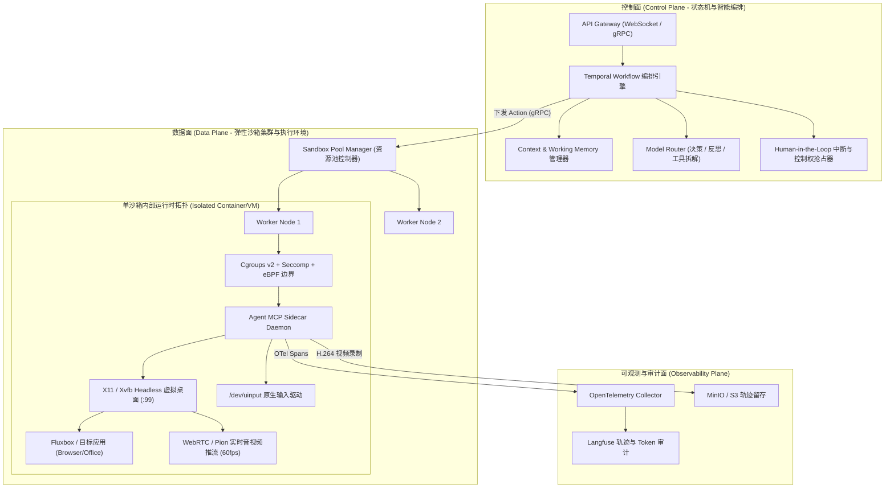
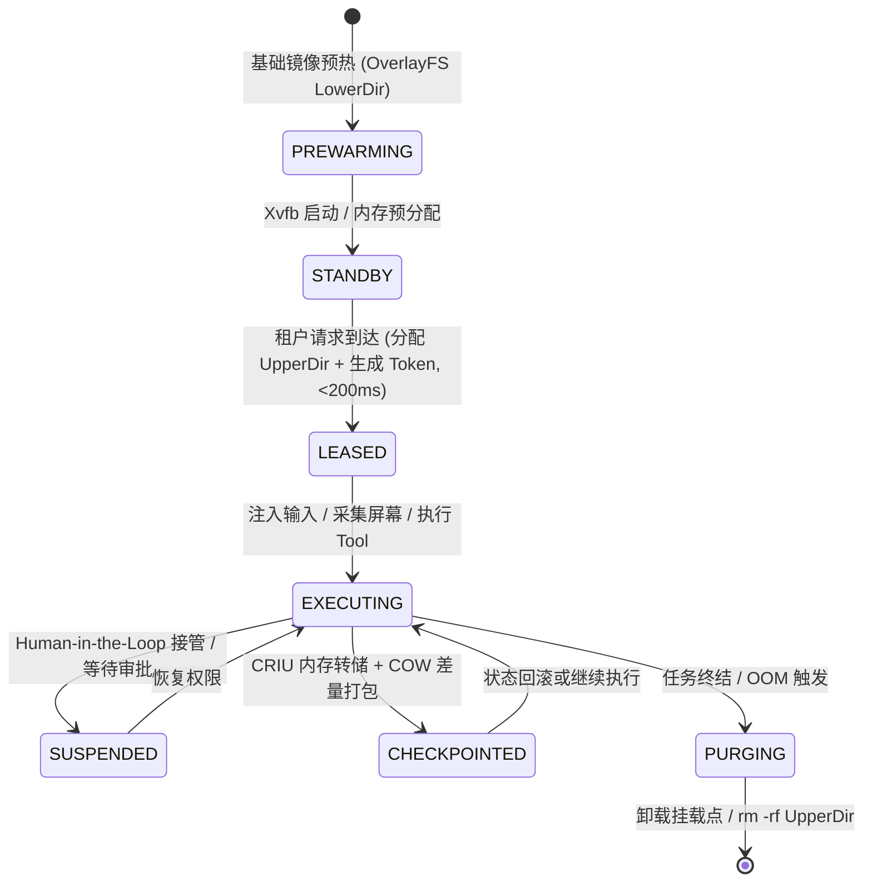

# AI Agent 系统后端架构师（Computer Use & 沙箱运行时）全景学习与求职规划文档

> **定位目标**：对标北京顶尖 AI Agent 创业团队核心技术岗（纯现金顶薪）  
> **核心方向**：云端 Agent 核心系统、沙箱运行时生命周期（Sandbox Runtime Lifecycle）、分布式长任务调度（Temporal）、高可用与可观测性体系

---

### 📚 专题技术深度笔记与代码直达

| 专题编号 | 核心主题 | 状态 | 对应工程源码实现 |
| :--- | :--- | :---: | :--- |
| **专题 00** | [隔离之锁：安全沙箱与本地执行治理策略](./00_sandbox_governance_and_security_redlines.md) | 🟢 已交付 | [`aegis-sandbox/src/executor.py`](file:///Users/mark/GitHub/agent-architect-lab/aegis-sandbox/src/executor.py) |
| **专题 01** | [沙箱运行时生命周期（一）：OverlayFS 预热池与 COW 秒级重置](./01_sandbox_prewarming_and_overlayfs_cow.md) | 🟢 已交付 | [`aegis-sandbox/src/pool.py`](file:///Users/mark/GitHub/agent-architect-lab/aegis-sandbox/src/pool.py) |
| **专题 02** | [沙箱运行时生命周期（二）：X11 MIT-SHM 零拷贝截屏与 /dev/uinput 输入注入](./02_x11_mit_shm_capture_and_uinput_injection.md) | 🟢 已交付 | [`aegis-sandbox/src/display.py`](file:///Users/mark/GitHub/agent-architect-lab/aegis-sandbox/src/display.py) |
| **专题 03** | [分布式状态机：基于 Temporal.io 的长程任务重放与 Human-in-the-Loop 中断](./03_temporal_workflow_and_event_sourcing_state_machine.md) | 🟢 已交付 | [`aegis-sandbox/src/orchestrator.py`](file:///Users/mark/GitHub/agent-architect-lab/aegis-sandbox/src/orchestrator.py) |
| **专题 04** | MCP 2.0 服务化治理与高性能双向流式工具调用总线 | 🟡 即将开启 | 规划中 |

---

## 一、 岗位需求深度解构与技术锚点

根据目标岗位 JD，团队的核心痛点集中在：**长程任务不可靠、多工具执行状态失控、沙箱冷启动慢与环境易被污染、用户无法低延迟交互介入**。

| 招聘核心诉求 | 工业级架构对应考点 | 考核及格线 | 架构师降维打击线 |
| :--- | :--- | :--- | :--- |
| **沙箱运行时生命周期** | Linux 隔离、冷启动消除、GUI 管道 | 跑通 Docker 容器并挂载卷 | **基于 OverlayFS 的预热池（<200ms）、X11 共享内存零拷贝截屏、Seccomp/eBPF 阻断内网渗透、CRIU 状态回滚** |
| **任务调度与异步队列** | 任务编排、长程执行自愈、状态流转 | Celery / Redis 队列、MySQL 记录状态 | **基于 Temporal.io 的确定性重放与事件溯源（Event Sourcing）、Saga 模式工具回滚补偿** |
| **工具调用与插件化** | 标准通信协议、环境 Sidecar 治理 | 简单的 HTTP / RPC 调用 | **遵循 MCP（Model Context Protocol）规范的 Sidecar 架构、UDS/gRPC 双向多路复用流** |
| **可观测性与容错** | 链路监控、轨迹回放、故障自愈 | 日志收集、ELK / Prometheus 监控 | **OpenTelemetry 结构化 Trajectory Span 语义标准、Langfuse 全链路 Trace、坏 Case 自动捕获与回归测试集构建** |

---

## 二、 系统架构全景蓝图（Computer Use Agent Backend）

生产级 Agent 后端必须实现**控制面（Control Plane）与数据面（Data Plane）的物理与逻辑解耦**：



---

## 三、 四大核心专题技术攻坚路线

### 专题 1：沙箱运行时生命周期深度剖析（核心壁垒）

沙箱生命周期必须划分为严格的五大闭环阶段：



#### ① 预热池与毫秒级冷启动（Pre-warming Pool）
- **核心难点**：安装完整 Desktop GUI（Xvfb、Fluxbox、Chrome、中文字体）的镜像重达 2~4GB，普通拉起需 4~8 秒。
- **技术突破方案**：
  - **Gold Image 固化**：不可变只读层（LowerDir），预装完整环境与依赖。
  - **OverlayFS 动态挂载**：沙箱分配瞬间，仅在宿主机分配轻量级的 `upperdir` 和 `workdir`：
    ```bash
    mount -t overlay overlay -o lowerdir=/opt/gold_image,upperdir=/data/sandbox_101/upper,workdir=/data/sandbox_101/work /mnt/sandbox_101/rootfs
    ```
  - **水位线管理（Capacity Watermark）**：维护待命队列（Standby Queue），常驻维持 $N$ 个预热实例，分配时通过 CAS 原语完成所有权转移。

#### ② 内核级安全加固（Hardening & Security）
- **Cgroups v2 严格约束**：
  - `pids.max = 512`：彻底防御因 Agent 代码错误或恶意脚本导致的 Fork 炸弹。
  - `memory.max` 配合 `memory.oom.group = 1`：发生 OOM 时整组清除，避免僵尸进程驻留。
- **Seccomp 系统调用白名单**：
  - 利用 BPF 规则严厉过滤 `ptrace`、`sys_chroot`、`keyctl` 及危险命名空间 flag，阻断逃逸。
- **eBPF 出站网络沙盒**：
  - 挂载 eBPF `sock_ops` 探针，强制阻断发往内网保留网段（`10.0.0.0/8`, `172.16.0.0/12`, `192.168.0.0/16`）及云元数据 API（`169.254.169.254`）的连接，仅放行 DNS 与白名单域名。

#### ③ GUI 管道与无损操作注入（Display & Input Pipeline）
- **X11 共享内存高速截屏（MIT-SHM）**：
  - 弃用磁盘中转写入临时图片，通过 `XShmGetImage` 直接读取 FrameBuffer，截屏耗时压低至 **< 8ms**。
- **WebRTC 低延迟桌面推流**：
  - 整合 Go + Pion WebRTC 管道，捕获 X11 帧并送入硬件编码器，实现 **< 100ms** 端到端延迟的 Web 可视化画面。
- **内核级事件注入**：
  - 深入 Linux 内核输入子系统 `/dev/uinput` 模拟硬件级按键与平滑轨迹移动，避免高分屏坐标漂移与修饰键丢失问题。

#### ④ 进程级状态快照与回滚（CRIU & State Persistence）
- **CRIU（Checkpoint/Restore In Userspace）集成**：
  - 在关键节点将沙箱内的进程树（浏览器、文档应用）内存转储，结合 OverlayFS UpperDir 生成增量检查点。
  - 任务陷入死循环或执行偏离目标时，直接一键恢复内存与文件系统状态。

---

### 专题 2：长程任务调度与分布式状态机（Temporal.io）

#### 为什么弃用传统消息队列（Celery/BullMQ/RabbitMQ）？
- **传统队列缺陷**：无状态、无法追踪复杂执行分支、一旦 Worker 宕机长程上下文全部丢失、难以实现长达数小时的“等待人工介入”。
- **Temporal 的绝对优势**：
  - **Event Sourcing（事件溯源）**：每一步 LLM 思考与 Tool 调用均作为不可变事件持久化。
  - **Deterministic Replay（确定性重放）**：Worker 挂掉后，新 Worker 基于历史事件瞬间无缝重构内存状态，无需重复消耗 Token。
  - **原生 Human-in-the-Loop**：使用 `workflow.GetSignalChannel` 原生支持信号等待与控制权抢占。

#### 核心状态机代码设计模式（Go 伪代码）

```go
func ComputerUseAgentWorkflow(ctx workflow.Context, task UserGoal) error {
    state := NewAgentState(task)
    takeoverSignal := workflow.GetSignalChannel(ctx, "TakeoverSignal")
    resumeSignal := workflow.GetSignalChannel(ctx, "ResumeSignal")

    for !state.IsCompleted() {
        // 1. 检查是否存在人工抢占信号 (Non-blocking)
        var signal TakeoverPayload
        if takeoverSignal.ReceiveWithTimeout(ctx, 0, &signal) {
            // 挂起 Agent 自动执行，等待人工在 WebRTC 桌面操作完毕
            resumeSignal.Receive(ctx, nil)
        }

        // 2. 调度执行单步 Action Activity (LLM 决策 + 沙箱操作)
        var stepResult StepExecutionResult
        err := workflow.ExecuteActivity(ctx, ExecuteStepActivity, state.CurrentContext()).Get(ctx, &stepResult)
        if err != nil {
            // 触发回滚补偿机制
            return workflow.ExecuteActivity(ctx, RollbackToCheckpointActivity, state.LastCheckpointID).Get(ctx, nil)
        }

        state.Update(stepResult)
    }
    return nil
}
```

---

### 专题 3：MCP（Model Context Protocol）与工具服务化

- **Sidecar 通信架构**：
  - 沙箱内部署独立的 MCP Server，通过 Unix Domain Socket (UDS) 或 mTLS gRPC 与外部调度器通信。
- **协议能力抽象**：
  - 严谨实现 MCP 规范的 Tools、Resources 与 Prompts 接口。
  - 原子操作契约化：`desktop.screenshot`、`desktop.click`、`desktop.type`、`fs.write_file`、`bash.exec`。
- **背压与多路复用（Backpressure & Multiplexing）**：
  - 避免截屏与大文件传输阻塞控制指令流，采用双通道分离（Control Stream + Media Stream）。

---

### 专题 4：全链路可观测性与轨迹评测（Observability & Trajectory）

- **OpenTelemetry 语义标准**：
  - 每个 Agent 步骤抽象为独立的 Span：
    - `gen_ai.system`: 模型类型（e.g., Claude 3.7 Sonnet / Qwen2.5-VL）
    - `agent.action.type`: `click` / `type` / `bash`
    - `agent.screen.before_hash`: 操作前画面特征
    - `agent.screen.after_hash`: 操作后画面特征
    - `agent.screen.diff_ratio`: 视觉画面变化率
- **Langfuse 深度集成**：
  - 自动上报 Token 消耗、执行耗时、工具执行状态，形成可一键回放的 Trajectory Timeline。

---

## 四、 核心实战项目设计：`Aegis-Sandbox`

打造一个可部署、具备完整 Benchmark 数据的开源级项目，作为简历与面试的核心武器。

### 1. 代码工程目录结构

```text
aegis-sandbox/
├── cmd/
│   ├── orchestrator/          # Temporal Workflow 编排服务
│   └── pool-manager/          # 沙箱资源池控制器 Daemon
├── pkg/
│   ├── sandbox/               # 沙箱底层核心驱动包
│   │   ├── overlayfs.go       # OverlayFS 挂载/卸载/UpperDir 回收
│   │   ├── pool.go            # 基于原子 CAS 的 Standby 预热池
│   │   ├── shm_capture.go     # X11 MIT-SHM 内存映射高速截屏
│   │   ├── uinput_driver.go   # Linux 内核 /dev/uinput 事件注入
│   │   └── security.go        # Seccomp 白名单与 Cgroups v2 限额注入
│   ├── mcp/                   # MCP 协议标准实现
│   │   ├── server.go          # 容器内 Sidecar Daemon
│   │   └── client.go          # 控制面 gRPC 客户端
│   ├── webrtc/                # 基于 Pion 的 X11 桌面采集推流
│   └── telemetry/             # OpenTelemetry + Langfuse 轨迹中间件
├── deployments/
│   ├── Dockerfile.gold        # 不可变 Gold Image 构建脚本 (Xvfb+Fluxbox+Chrome)
│   └── seccomp-profile.json   # 生产级安全加固配置文件
└── Makefile
```

### 2. 简历可量化核心技术指标

- **冷启动时间**：从原生的 Docker 启动（平均 **4.2s**）压缩至 **180ms**（基于 OverlayFS 预热池）。
- **截屏与传输延迟**：单帧 MIT-SHM 截屏耗时 **< 8ms**，WebRTC 端到端桌面推流延迟 **< 90ms**。
- **内核级安全防御**：通过 Seccomp 拦截 **180+** 危险系统调用，Cgroups v2 实现 **100%** Fork 炸弹免疫。
- **长程任务恢复率**：基于 Temporal 事件溯源与 Checkpoint 重试，50 步以上长任务偶发异常自愈率达到 **94%**。

---

## 五、 4 周极速突击实施时间表

```text
第 1 周：Linux 底层沙箱机制攻关
├── 熟练掌握 mount -t overlay 挂载机制与 UpperDir 快速重置
├── 编写 Go / C 代码调通 X11 MIT-SHM 共享内存截屏与 /dev/uinput 输入注入
└── 编写 Seccomp 规则与 Cgroups v2 配额，验证恶意代码与 Fork 炸弹拦截

第 2 周：开发 Sandbox Pool Manager（Go 语言）
├── 实现 Standby Pool 队列及状态机流转（PREPARING -> READY -> LEASED -> PURGING）
├── 封装 gRPC 接口，对外提供沙箱租借、命令执行、快速回收功能
└── 在容器内植入符合 MCP 规范的 Sidecar 交互守护进程

第 3 周：集成 Temporal 工作流与长程状态机
├── 搭建 Temporal 集群，使用 Go/Python 编写 Agent 编排 Workflow
├── 实现 Human-in-the-Loop 的 Signal/Query 机制（无损暂停/恢复控制权）
└── 模拟网络抖动与 Worker 随机 Kill，验证确定性重放与断点续跑能力

第 4 周：可观测性、数据复盘与面试答辩准备
├── 接入 Langfuse 与 Prometheus，生成完整 Trajectory 链路与性能看板
├── 整理架构图、Benchmark 对比压测报告并上传 GitHub
└── 针对高并发沙箱资源泄露、网络穿透、CRIU 状态回滚等深水区场景做模拟答辩
```

---

## 六、 架构师级面试高频深水区问答指南

### Q1: 在高并发场景下，如何防止沙箱由于任务异常崩溃导致宿主机资源泄露？
> **答题要点**：
> 1. **生命周期租约（Lease & Heartbeat）**：每个沙箱分配独立的 Lease TTL（如 5 分钟），Sidecar 必须周期性上报心跳，心跳中断或租约超时立即触发强杀流程。
> 2. **Cgroups v2 OOM 组联杀**：开启 `memory.oom.group = 1`，防止只杀子进程导致父进程挂起。
> 3. **Init 进程职责**：容器内使用 `tini` 或 `dumb-init` 作为 1 号进程，正确收割退出子进程的 `SIGCHLD` 信号，避免产生僵尸进程占满 PID 表。

### Q2: 为什么使用 X11 共享内存（MIT-SHM）截屏比传统截屏快数十倍？
> **答题要点**：
> 1. **避免网络/套接字复制**：传统 X11 截屏通过 X11 Protocol 套接字传输大块像素数据，涉及多次内核态到用户态的拷贝。
> 2. **内存直接映射**：MIT-SHM 扩展允许 X Server 与客户端进程共享同一块物理内存（`shmat` / POSIX `shm_open`），截屏操作仅需通知 X Server 将当前 FrameBuffer 拷贝进共享内存段，客户端直接读取指针，耗时从 100ms+ 降至 5~8ms。

### Q3: 当 Agent 需要操作支付、修改密码等敏感行为时，系统如何在架构层实现安全阻断？
> **答题要点**：
> 1. **策略拦截网关（Policy Enforcement Point）**：在 Temporal Activity 执行前加入基于规则或小模型的敏感操作探测器（例如检测到目标输入框属性为 `type=password`，或操作涉及转账按钮）。
> 2. **Workflow Signal 挂起**：触发安全策略时，Workflow 进入等待 Signal 状态，前端界面弹出审批或接管悬浮窗。
> 3. **Session 切换**：通过 WebRTC 将操作控制权临时移交给用户，用户操作完毕后发送 `ResumeSignal`，Workflow 恢复自动化执行。
