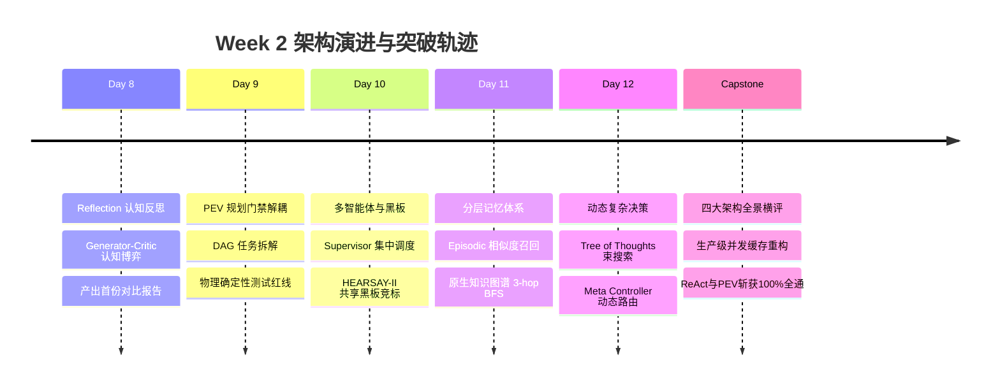

# Week 2 阶段综合复盘与架构认知跃迁报告 (Synthesis Report)

> **复盘周期**：2026-09-09 ~ 2026-09-10  
> **归属阶段**：Phase 2: 架构纵横对比与范式攻坚 (`all-agentic-architectures`)  
> **累计学时投入**：**16.5 小时**（全实验室累计 **29.5 小时 / 90.0 小时**，整体进度 **32.8%**）  
> **核心结项标志**：顺利交付四大架构客观物理基准横评 [03_comprehensive_architecture_benchmark.md](file:///Users/mark/GitHub/agent-architect-lab/docs/02-benchmark-reports/03_comprehensive_architecture_benchmark.md)  

---

## 1. Week 2 战役全景与交付物清单

Week 2 聚焦于从最简单的 ReAct 单一智能体向**复杂多智能体、分层记忆与动态多态决策体系**的全面跨越。本周全程践行“**零第三方框架依赖、100% 纯 Python 原生手搓、物理单测强制拦截**”的工程标准，交付了 6 套高标准架构原型与 2 份横向对比报告：

### 📦 核心源码与文档资产表：
| 编号 | 架构范式 / 主题 | 核心代码实现 | 深度技术文档 | 核心技术亮点 |
| :--- | :--- | :--- | :--- | :--- |
| **Day 8** | **Reflection 反思模式** | [day08_reflection.py](file:///Users/mark/GitHub/agent-architect-lab/mini-harness/src/day08_reflection.py) | [day08_reflection_pattern.md](file:///Users/mark/GitHub/agent-architect-lab/docs/01-architecture-notes/day08_reflection_pattern.md) | Generator-Critic 认知双角色、Rubric 细则评分打磨 |
| **Day 9** | **PEV 规划与单步门禁** | [day09_pev.py](file:///Users/mark/GitHub/agent-architect-lab/mini-harness/src/day09_pev.py) | [day09_planning_and_pev.md](file:///Users/mark/GitHub/agent-architect-lab/docs/01-architecture-notes/day09_planning_and_pev.md) | 目标解耦 DAG、局部 Executor、独立 Verifier 物理红线 |
| **Day 10** | **多智能体协作与共享黑板**| [day10_multi_agent.py](file:///Users/mark/GitHub/agent-architect-lab/mini-harness/src/day10_multi_agent.py) | [day10_multi_agent_and_blackboard.md](file:///Users/mark/GitHub/agent-architect-lab/docs/01-architecture-notes/day10_multi_agent_and_blackboard.md) | Supervisor 安全钳、黑板竞标机制与垄断衰减衰退算法 |
| **Day 11** | **分层记忆与图谱推理** | [day11_hierarchical_memory.py](file:///Users/mark/GitHub/agent-architect-lab/mini-harness/src/day11_hierarchical_memory.py) | [day11_hierarchical_memory.md](file:///Users/mark/GitHub/agent-architect-lab/docs/01-architecture-notes/day11_hierarchical_memory.md) | Episodic 相似度召回、Graph 邻接表与 3-hop 多跳因果推导 |
| **Day 12** | **思维树搜索与动态元控制器**| [day12_tot_and_meta_controller.py](file:///Users/mark/GitHub/agent-architect-lab/mini-harness/src/day12_tot_and_meta_controller.py) | [day12_tot_and_meta_controller.md](file:///Users/mark/GitHub/agent-architect-lab/docs/01-architecture-notes/day12_tot_and_meta_controller.md) | ToT 束搜索剪枝算子、复杂意图动态分流与优雅降级总线 |
| **结项** | **四大架构全景物理横评** | [benchmark_runner.py](file:///Users/mark/GitHub/agent-architect-lab/mini-harness/benchmark_week2/benchmark_runner.py) | [03_comprehensive_architecture_benchmark.md](file:///Users/mark/GitHub/agent-architect-lab/docs/02-benchmark-reports/03_comprehensive_architecture_benchmark.md) | 实测 Direct(0%) vs ReAct(100%) vs Reflection(0%) vs PEV(100%) |

---

## 2. 认知升维：本周核心技术攻坚精要

### ① 为什么真实工业级系统必须以“物理测试”为唯一门禁？
在今天的 Capstone 结项横评中，我们观察到了极富戏剧性的一幕：
- **Reflection 模式下的初稿明明已经达到了 100% 满分**，但 Critic 法官为了体现自己的“批判价值”，凭空罗列了将近 10,000 字符的哲学级批评，最终导致 Refiner 上下文爆炸、把原本正确的代码改成了无法编译的残篇（0%）。
- 这彻底破除了“让 LLM 当裁判能保证质量”的迷信。在真正的生产级系统（如 Claude Code / Cursor）中，**判定代码合格与否的永远是 OS Exit Code 和测试断言，绝不能是 LLM 的文学点评**！

### ② ReAct 与 PEV 的本质分工与工业协同
- **ReAct** 是**高敏捷性的手术刀**：它没有长篇大论的预先规划，靠着一次次工具执行与报错反馈，在 23 秒内迅速定位并修正了并发锁与浅拷贝缺陷，适合定位范围明确、步长较短的排障；
- **PEV** 是**大工程的施工图纸**：面对跨模块、多层依赖的重构，必须先由 Planner 降维分工，使得每个步骤的局部上下文清晰可控，避免大模型在长链路中遗忘关键约束；
- **工业演进结论**：现代顶级 Agent（如 Claude Code 的 Agent 模式或 Devin）本质上是 **PEV 外壳 + ReAct 内核** 的融合体 —— 用 PEV 控制阶段性里程碑与客观门禁，在具体里程碑内由 ReAct 灵活调用 Bash/Read/Edit 工具闭环执行。

### ③ 分层记忆体系对长上下文膨胀的治理
在 Day 11 的探索中，我们攻克了长期记忆的虚假膨胀问题：
- **短期工作记忆 (Working Memory)**：必须实施严格的滑动窗口裁剪与快照；
- **情景记忆 (Episodic Memory)**：记录过去的成功执行轨迹或踩坑经验，按需相似度唤醒；
- **图谱记忆 (Graph Memory)**：通过实体与关系的邻接表，利用确定性 BFS 算法进行多跳查询，让大模型在不污染大上下文的前提下，精准提取 `A -> B -> C -> D` 的跨层级拓扑关系。

---

## 3. 阶段目标燃尽与 Week 3 展望

### 📈 工时与进度达成状态：
* **Phase 1 (底层驱动)**：`13.0h / 22.0h`（交付 mini-harness v0.1）
* **Phase 2 (架构纵横)**：`16.5h / 24.0h`（交付 6 大架构原型 + 2 份横向基准评测报告）
* **全实验室累计学时**：**29.5 小时 / 90.0 小时**（进度稳步推进至 **32.8%**）
* **本地推理生态**：已完全走通 LM Studio `qwen/qwen3.8-27b` 与 `google/gemma-4-12b-qat` 双模型无缝热切换。

### 🚀 Week 3 冲刺前瞻 —— 工业级蜕变：驾驭工程与系统防御 (Harness Engineering)
随着基础架构与范式的全面通关，我们即将正式进军 [harness-books Book 1](https://github.com/wquguru/harness-books/tree/main/book1-claude-code)：
1. **Day 15 (Ch 1 & Ch 2)**：拆解 Claude Code 的核心哲学 —— **“模型是引擎，Harness 是车身”**，实现以 Prompt 作为控制面的有限状态机（FSM）；
2. **Day 16 (Ch 3)**：研读 Query Loop 驱动机制与心跳保活；
3. **Day 17 (Ch 4)**：工具权限分级系统与人在回路（HITL Interrupt）机制；
4. **Day 18 (Ch 5)**：**上下文硬核压紧（Context Compaction）**—— 滑动窗口裁剪、无损摘要与记忆剪枝；
5. **Day 19 (Ch 6)**：崩溃恢复机制、子进程沙箱隔离与死锁熔断；
6. **Weekend 交付物**：**发布 `mini-harness v0.2`**，实现长达 50 步的长链路工程防御。

Week 2 完美结项收官！向工业级 Harness 进发！
